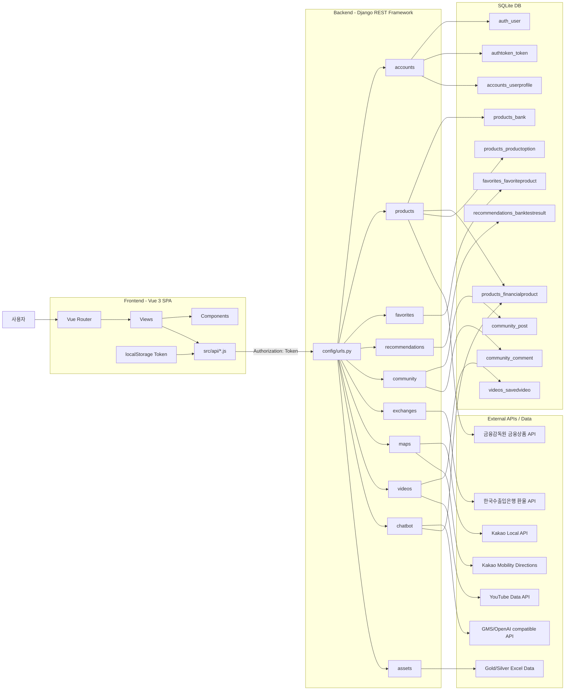
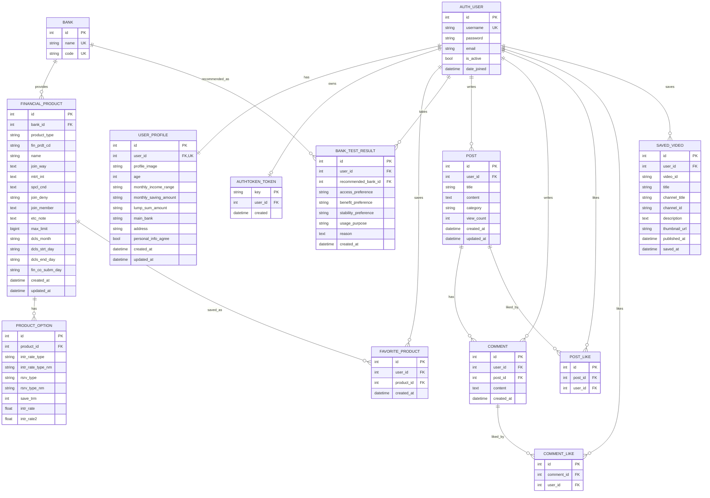
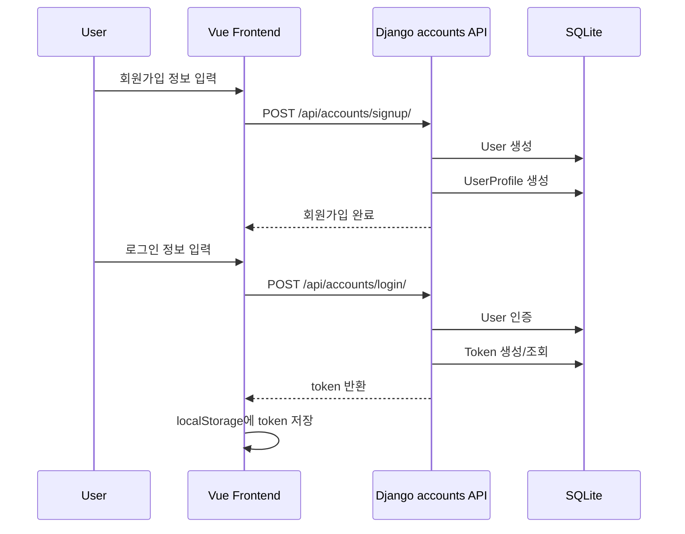
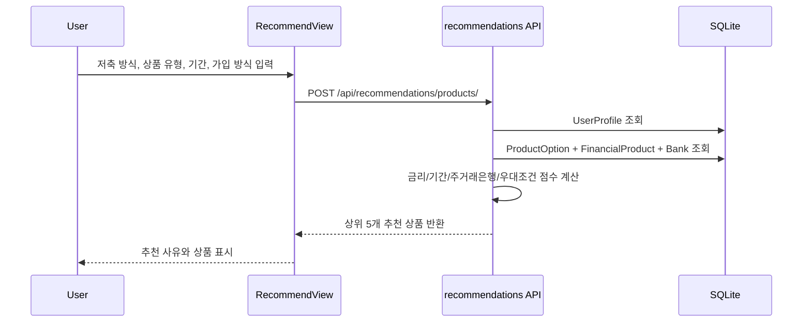
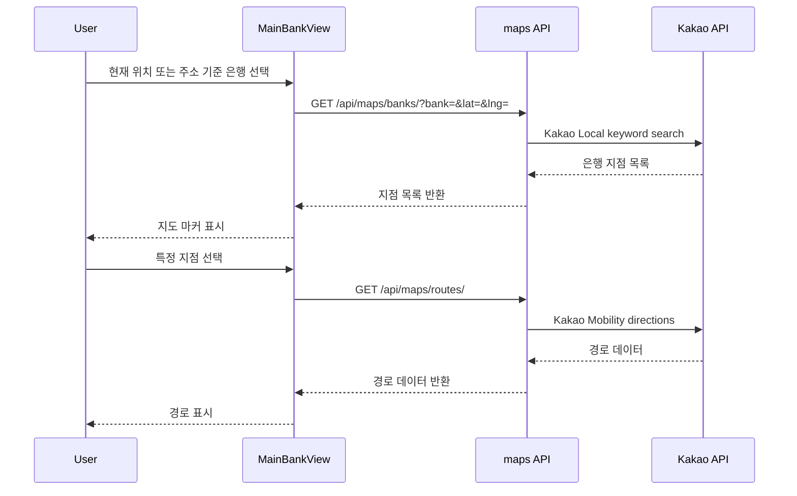
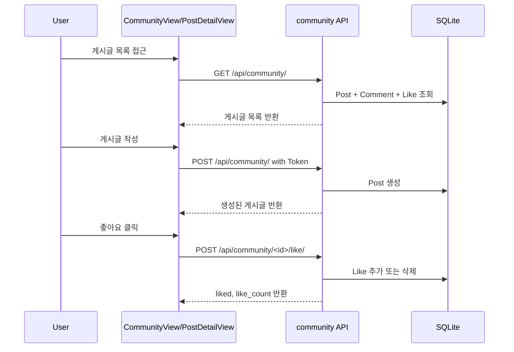

# 예적금 추천 서비스 ERD · 아키텍처 · 구현 정리

> 기준 파일: 업로드된 `backend.zip`, `frontend.zip`의 현재 코드 구조  
> 범위: Django REST Framework 백엔드, Vue 3 프론트엔드, DB 모델, 외부 API 연동, 주요 기능 흐름

---

## 1. 프로젝트 한 줄 정의

사용자의 금융 프로필과 선호 조건을 기반으로 예금·적금 상품을 조회·비교·추천하고, 은행 위치/경로, 환율, 금융 챗봇, 커뮤니티, 금융 영상 저장 기능을 제공하는 금융 생활 시작 가이드 서비스이다.

---

## 2. 전체 기술 스택

| 구분 | 사용 기술 | 현재 코드 기준 역할 |
|---|---|---|
| Frontend | Vue 3, Vite | SPA 화면 구성 |
| Routing | Vue Router | `/products`, `/recommend`, `/mypage`, `/community` 등 화면 전환 |
| API 통신 | Axios | Django REST API 호출, Token 인증 헤더 주입 |
| State | Pinia | 현재는 기본 `counter` store만 존재. 핵심 인증 상태는 `localStorage` 중심 |
| Chart | Chart.js | 환율/금·은 시세 그래프 표시 |
| Backend | Django 5.x | 서버 애플리케이션 |
| API | Django REST Framework | REST API 제공 |
| Auth | DRF TokenAuthentication | 로그인 시 토큰 발급, 프론트 localStorage 저장 |
| DB | SQLite | 개발용 DB |
| File Upload | Django Media | 프로필 이미지 저장 |
| External API | 금융감독원, 한국수출입은행, Kakao, YouTube, GMS/OpenAI 호환 API | 상품, 환율, 지도/경로, 영상, 챗봇 기능 |
| Local Data | Excel | 금/은 가격 데이터 로딩 |

---

## 3. 전체 폴더 구조 요약

### Backend

```txt
backend/
  config/
    settings.py
    urls.py
  accounts/
    models.py
    serializers.py
    views.py
    urls.py
  products/
    models.py
    serializers.py
    views.py
    urls.py
  favorites/
    models.py
    serializers.py
    views.py
    urls.py
  recommendations/
    models.py
    serializers.py
    views.py
    urls.py
  community/
    models.py
    serializers.py
    views.py
    urls.py
  exchanges/
    views.py
    urls.py
  maps/
    views.py
    urls.py
  chatbot/
    views.py
    urls.py
  videos/
    models.py
    serializers.py
    views.py
    urls.py
  assets/
    data/
      Gold_prices.xlsx
      Silver_prices.xlsx
    views.py
    urls.py
```

### Frontend

```txt
frontend/
  src/
    api/
      api.js
      accounts.js
      products.js
      favorites.js
      recommendations.js
      community.js
      videos.js
    components/
      NavBar.vue
      ChatbotFloatingButton.vue
      ChatbotWindow.vue
      ProductCard.vue
      PostCard.vue
      BankFitTest.vue
    views/
      HomeView.vue
      LoginView.vue
      SignupView.vue
      FindUsernameView.vue
      ResetPasswordView.vue
      MyPageView.vue
      ProductListView.vue
      ProductDetailView.vue
      RecommendView.vue
      BankTestView.vue
      BankTestResultView.vue
      MainBankView.vue
      ExchangeView.vue
      CommunityView.vue
      PostDetailView.vue
      SpotAssetView.vue
    router/
      index.js
```

---

## 4. 시스템 아키텍처



---

## 5. Django App별 책임

| App | DB 모델 보유 | 주요 책임 |
|---|---:|---|
| `accounts` | O | 회원가입, 로그인, 로그아웃, 프로필, 아이디 찾기, 비밀번호 재설정/변경, 회원탈퇴 |
| `products` | O | 금융감독원 API에서 예금/적금 상품 저장, 상품 목록/상세 조회 |
| `favorites` | O | 로그인 사용자의 관심상품 추가/삭제/조회 |
| `recommendations` | O | 주거래은행 성향 테스트 결과 저장, 예적금 상품 추천 점수 계산 |
| `community` | O | 게시글, 댓글, 좋아요, 조회수 |
| `videos` | O | YouTube 검색, 상세 조회, 저장 영상 관리 |
| `exchanges` | X | 한국수출입은행 환율 조회, 기간별 환율, 환전 계산 |
| `maps` | X | Kakao 은행 지점 검색, 경로 검색 |
| `chatbot` | X | 금융용어/상품 설명 챗봇, 상품 DB context 활용 |
| `assets` | X | 금/은 Excel 데이터 기반 시세 조회 |

---

## 6. ERD

> 아래 ERD는 실제 DB에 저장되는 핵심 모델 기준이다.  
> `exchanges`, `maps`, `chatbot`, `assets`는 현재 별도 DB 모델 없이 외부 API 또는 파일 데이터를 조회하는 구조라 ERD에는 포함하지 않았다.



---

## 7. 테이블 설계 설명

### 7-1. 사용자/프로필

| 테이블 | 설명 |
|---|---|
| `auth_user` | Django 기본 사용자 테이블. username, password, email, is_active 등을 보관 |
| `accounts_userprofile` | 금융 프로필 확장 테이블. User와 1:1 관계 |
| `authtoken_token` | DRF TokenAuthentication에서 사용하는 인증 토큰 |

`UserProfile`에 나이, 월 소득 구간, 월 저축 가능 금액, 보유 목돈, 주거래은행, 거주 지역, 개인정보 동의, 프로필 이미지를 저장한다. 추천 기능은 이 프로필 정보를 보조 점수로 사용한다.

### 7-2. 금융상품

| 테이블 | 설명 |
|---|---|
| `products_bank` | 은행명과 금융회사 코드 저장 |
| `products_financialproduct` | 예금/적금 상품의 기본 정보 저장 |
| `products_productoption` | 상품별 기간, 저축 유형, 기본금리, 최고우대금리 저장 |

금융감독원 API의 `baseList`는 `FinancialProduct`, `optionList`는 `ProductOption`에 저장하는 구조다. 상품 중복 방지를 위해 `FinancialProduct`는 `(bank, fin_prdt_cd, product_type)`, `ProductOption`은 `(product, intr_rate_type, rsrv_type, save_trm)` 기준으로 유니크 제약을 둔다.

### 7-3. 관심상품

| 테이블 | 설명 |
|---|---|
| `favorites_favoriteproduct` | 사용자가 저장한 금융상품 |

`(user, product)` 조합에 유니크 제약이 있어 같은 상품을 중복 저장하지 않는다.

### 7-4. 추천 결과

| 테이블 | 설명 |
|---|---|
| `recommendations_banktestresult` | 주거래은행 성향 테스트 결과 및 추천 은행 저장 |

주거래은행 추천은 사용자의 접근성 선호, 혜택 선호, 안정성 선호, 사용 목적을 기준으로 은행을 추천하고 사유를 저장한다. 예적금 상품 추천은 별도 결과 테이블을 만들지 않고 요청 시점에 상품 옵션을 점수화하여 응답한다.

### 7-5. 커뮤니티

| 테이블 | 설명 |
|---|---|
| `community_post` | 게시글 |
| `community_comment` | 댓글 |
| `community_post_likes` | 게시글 좋아요 M:N 중간 테이블 |
| `community_comment_likes` | 댓글 좋아요 M:N 중간 테이블 |

게시글과 댓글은 작성자 `User`와 연결된다. 게시글 상세 조회 시 조회수가 증가한다.

### 7-6. 저장 영상

| 테이블 | 설명 |
|---|---|
| `videos_savedvideo` | 사용자가 저장한 YouTube 영상 메타데이터 |

`(user, video_id)` 조합에 유니크 제약이 있어 같은 영상을 중복 저장하지 않는다.

---

## 8. 주요 기능 구현 정리

### 8-1. 인증/회원 관리

| 기능 | Frontend | Backend API | 처리 방식 |
|---|---|---|---|
| 회원가입 | `SignupView.vue` | `POST /api/accounts/signup/` | `User` 생성 후 `UserProfile` 생성 |
| 로그인 | `LoginView.vue` | `POST /api/accounts/login/` | `Token.objects.get_or_create()` 후 토큰 반환 |
| 로그아웃 | `NavBar.vue` 등 | `POST /api/accounts/logout/` | Django logout 처리 |
| 아이디 찾기 | `FindUsernameView.vue` | `POST /api/accounts/find-username/` | 이메일 기준 계정 조회 후 username 마스킹 반환 |
| 비밀번호 재설정 | `ResetPasswordView.vue` | `POST /api/accounts/reset-password/` | username + email 일치 확인 후 새 비밀번호 저장 |
| 프로필 조회 | `MyPageView.vue` | `GET /api/accounts/profile/` | 로그인 사용자 프로필 반환 |
| 프로필 수정 | `MyPageView.vue` | `PATCH /api/accounts/profile/update/` | 이메일/프로필/금융정보 수정, 이미지 업로드 가능 |
| 비밀번호 변경 | `MyPageView.vue` | `POST /api/accounts/password/change/` | 현재 비밀번호 검증 후 변경, 기존 토큰 삭제 |
| 회원탈퇴 | `MyPageView.vue` | `DELETE /api/accounts/withdraw/` | 비밀번호 검증 후 `is_active=False` 처리 |

### 8-2. 예금/적금 상품

| 기능 | API | 처리 방식 |
|---|---|---|
| 정기예금 저장 | `GET /api/products/deposits/save/` | 금융감독원 예금 API 호출 후 DB 저장 |
| 정기예금 목록 | `GET /api/products/deposits/` | DB가 비어 있으면 자동 저장 후 목록 반환 |
| 정기예금 상세 | `GET /api/products/deposits/<id>/` | 상품 기본정보 + 금리 옵션 반환 |
| 적금 저장 | `GET /api/products/savings/save/` | 금융감독원 적금 API 호출 후 DB 저장 |
| 적금 목록 | `GET /api/products/savings/` | DB가 비어 있으면 자동 저장 후 목록 반환 |
| 적금 상세 | `GET /api/products/savings/<id>/` | 상품 기본정보 + 금리 옵션 반환 |

### 8-3. 추천

| 기능 | API | 처리 방식 |
|---|---|---|
| 주거래은행 추천 | `POST /api/recommendations/main-bank/` | 성향 테스트 응답 기반 은행 추천, 결과 DB 저장 |
| 추천 이력 조회 | `GET /api/recommendations/history/` | 로그인 사용자의 추천 결과 조회 |
| 예적금 상품 추천 | `POST /api/recommendations/products/` | 상품 옵션을 금리, 기간, 주거래은행, 가입방식, 우대조건 기준으로 점수화 |

상품 추천 점수에는 다음 요소가 반영된다.

```txt
기본금리, 최고우대금리, 희망 기간, 저축 방식, 주거래은행,
가입 방식, 우대조건 단순성, 마이페이지 금융 프로필
```

### 8-4. 관심상품

| 기능 | API | 처리 방식 |
|---|---|---|
| 관심상품 목록 | `GET /api/favorites/` | 로그인 사용자의 저장 상품 조회 |
| 관심상품 토글 | `POST /api/favorites/<product_id>/` | 있으면 삭제, 없으면 생성 |

### 8-5. 커뮤니티

| 기능 | API | 처리 방식 |
|---|---|---|
| 게시글 목록 | `GET /api/community/` | 전체 게시글 조회 |
| 게시글 작성 | `POST /api/community/` | 로그인 사용자만 작성 |
| 게시글 상세 | `GET /api/community/<post_id>/` | 조회수 증가 후 상세 반환 |
| 게시글 수정 | `PUT /api/community/<post_id>/` | 작성자만 가능 |
| 게시글 삭제 | `DELETE /api/community/<post_id>/` | 작성자만 가능 |
| 게시글 좋아요 | `POST /api/community/<post_id>/like/` | 로그인 사용자 좋아요 토글 |
| 댓글 작성 | `POST /api/community/<post_id>/comments/` | 로그인 사용자만 작성 |
| 댓글 수정/삭제 | `PUT/DELETE /api/community/comments/<comment_id>/` | 작성자만 가능 |
| 댓글 좋아요 | `POST /api/community/comments/<comment_id>/like/` | 로그인 사용자 좋아요 토글 |

### 8-6. 지도/경로

| 기능 | API | 처리 방식 |
|---|---|---|
| 은행 지점 검색 | `GET /api/maps/banks/?bank=&lat=&lng=` | Kakao Local API로 반경 5km 은행 지점 검색 |
| 경로 검색 | `GET /api/maps/routes/?origin_lat=&origin_lng=&destination_lat=&destination_lng=` | Kakao Mobility Directions API 호출 |

프론트 `MainBankView.vue`는 Kakao 지도 SDK를 로딩하고, 백엔드 API로 은행 지점/경로 정보를 받아 지도에 표시한다.

### 8-7. 환율

| 기능 | API | 처리 방식 |
|---|---|---|
| 환율 목록 | `GET /api/exchanges/rates/?date=` | 한국수출입은행 API 호출 |
| 기간별 환율 | `GET /api/exchanges/history/?currency=&start_date=&end_date=` | 최대 31일 범위 환율 조회 |
| 환전 계산 | `POST /api/exchanges/calculate/` | KRW 금액을 선택 통화로 환산 |

### 8-8. 챗봇

| 기능 | API | 처리 방식 |
|---|---|---|
| 금융 챗봇 | `POST /api/chatbot/explain/` | GMS/OpenAI 호환 API 호출 |

챗봇은 사용자의 질문에 DB 저장 상품명이 포함되어 있으면 해당 상품 정보를 context로 구성한 뒤 LLM에 전달한다. 상품명이 없으면 금융용어/예금/적금/금리/환율 관련 질문인지 판단해 쉬운 설명을 반환한다.

### 8-9. YouTube 영상

| 기능 | API | 처리 방식 |
|---|---|---|
| 영상 검색 | `GET /api/videos/search/?q=&max_results=` | YouTube Data API 검색 |
| 영상 상세 | `GET /api/videos/<video_id>/` | YouTube video detail 조회 |
| 저장 영상 목록 | `GET /api/videos/saved/` | 로그인 사용자 저장 영상 조회 |
| 영상 저장 | `POST /api/videos/saved/` | 영상 메타데이터 DB 저장 |
| 저장 영상 삭제 | `DELETE /api/videos/saved/<video_id>/` | 저장 영상 삭제 |

### 8-10. 금/은 시세

| 기능 | API | 처리 방식 |
|---|---|---|
| 금/은 시세 조회 | `GET /api/assets/prices/?asset=gold&start_date=&end_date=` | Excel 파일 로딩 후 기간 필터링 |

`assets/data/Gold_prices.xlsx`, `assets/data/Silver_prices.xlsx`를 읽어 시세 행과 요약 통계를 반환한다.

---

## 9. 주요 사용자 흐름

### 9-1. 회원가입/로그인 흐름



### 9-2. 예적금 추천 흐름



### 9-3. 은행 지도/경로 흐름



### 9-4. 커뮤니티 흐름



---

## 10. 프론트엔드 화면-기능 매핑

| Route | View | 주요 기능 |
|---|---|---|
| `/` | `HomeView.vue` | 메인 화면 |
| `/login` | `LoginView.vue` | 로그인, 아이디 찾기/비밀번호 재설정 이동 |
| `/signup` | `SignupView.vue` | 회원가입 + 금융 프로필 입력 |
| `/find-username` | `FindUsernameView.vue` | 이메일 기반 아이디 찾기 |
| `/reset-password` | `ResetPasswordView.vue` | 아이디+이메일 기반 비밀번호 재설정 |
| `/products` | `ProductListView.vue` | 예금/적금 목록 조회 |
| `/products/:id` | `ProductDetailView.vue` | 상품 상세, 관심상품 등록 |
| `/recommend` | `RecommendView.vue` | 맞춤 예적금 추천 |
| `/bank-test` | `BankTestView.vue` | 주거래은행 성향 테스트 |
| `/bank-test/result` | `BankTestResultView.vue` | 추천 은행 결과 표시 |
| `/map`, `/main-bank` | `MainBankView.vue` | 은행 지도, 거리/경로 |
| `/exchange` | `ExchangeView.vue` | 환율 조회, 환전 계산, 그래프 |
| `/community` | `CommunityView.vue` | 게시글 목록/작성 |
| `/community/:id` | `PostDetailView.vue` | 게시글 상세, 댓글, 좋아요 |
| `/mypage` | `MyPageView.vue` | 프로필, 관심상품, 저장 영상, 계정 관리 |
| `/spot-assets` | `SpotAssetView.vue` | 금/은 시세 그래프 |

---

## 11. API 라우팅 구조

```txt
/api/accounts/
  signup/
  login/
  logout/
  find-username/
  reset-password/
  password/change/
  withdraw/
  profile/
  profile/update/
  profile/options/

/api/products/
  deposits/save/
  deposits/
  deposits/<product_id>/
  savings/save/
  savings/
  savings/<product_id>/

/api/favorites/
  <empty>
  <product_id>/

/api/recommendations/
  main-bank/
  history/
  products/

/api/community/
  <empty>
  <post_id>/
  <post_id>/like/
  <post_id>/comments/
  comments/<comment_id>/
  comments/<comment_id>/like/

/api/exchanges/
  rates/
  history/
  calculate/

/api/maps/
  banks/
  routes/

/api/videos/
  search/
  saved/
  saved/<video_id>/
  <video_id>/

/api/chatbot/
  explain/

/api/assets/
  prices/
```

---

## 12. 추천 알고리즘 정리

### 12-1. 주거래은행 추천

입력값:

```txt
access_preference       모바일/영업점/상관없음
benefit_preference      높은 금리/간단한 조건/안정성
stability_preference    시중은행/인터넷은행/상관없음
usage_purpose           목돈 보관/이자 수익/단기 운용
```

판단 로직:

```txt
1. 모바일 또는 인터넷은행 선호 → 카카오/케이/토스 계열 우선
2. 높은 금리 또는 이자 수익 선호 → 저장된 예금 상품 중 최고금리 높은 은행
3. 안정성 또는 시중은행 선호 → 국민/신한/우리/하나/농협 우선
4. 간단한 조건 선호 → 우대조건이 단순한 상품의 은행
5. 그 외 → 저장된 은행 중 기본값
```

### 12-2. 예적금 상품 추천

입력값:

```txt
saving_style            lump/monthly/unknown
product_type            deposit/saving/auto
preferred_term          6/12/24/36/any
main_bank               직접 입력 또는 프로필 주거래은행
bank_filter             all/main_bank_first/main_bank_only
condition_preference    simple/can_meet/unknown
join_preference         online/branch/any
```

점수 요소:

| 요소 | 반영 방식 |
|---|---|
| 기본금리 | 기본금리 × 8 |
| 최고우대금리 | 최고우대금리 × 12 |
| 희망 기간 | 기간 일치 시 가점 |
| 저축 방식 | 목돈은 예금, 매월 저축은 적금에 가점 |
| 주거래은행 | 사용자의 주거래은행과 상품 은행이 일치하면 가점 |
| 가입 방식 | 온라인/영업점 선호와 가입방법이 맞으면 가점 |
| 우대조건 | 단순 조건 선호 시 복잡한 실적 조건 감점 가능 |
| 프로필 | 월 저축 가능 금액, 보유 목돈, 개인정보 동의 보조 반영 |

---

## 13. 환경변수 정리

백엔드 `.env`에 필요한 값:

```env
FSS_API_KEY=금융감독원_금융상품_API_KEY
EXCHANGE_API_KEY=한국수출입은행_환율_API_KEY
KAKAO_REST_API_KEY=카카오_REST_API_KEY
YOUTUBE_API_KEY=유튜브_DATA_API_KEY
GMS_API_KEY=GMS_API_KEY
GMS_BASE_URL=https://gms.ssafy.io/gmsapi/api.openai.com/v1/
GMS_MODEL=gpt-5-nano
```

프론트에서 Kakao 지도 SDK를 직접 로딩하는 경우 `VITE_KAKAO_JAVASCRIPT_KEY` 또는 현재 코드에서 사용하는 환경변수명도 `.env`에 맞춰 정리해야 한다.

---

## 14. 현재 구조에서 좋은 점

1. 기능별 Django app 분리가 비교적 명확하다.
2. 예금/적금 상품 DB와 추천 기능이 연결되어 있어 단순 화면형 프로젝트보다 데이터 활용도가 높다.
3. 추천 사유를 함께 반환하므로 발표 시 설명 가능성이 높다.
4. 지도, 환율, 챗봇, 영상, 커뮤니티가 각각 독립 모듈로 구성되어 기능 시연 순서를 잡기 쉽다.
5. `UserProfile`을 중심으로 마이페이지, 추천, 지도 기능을 연결할 수 있는 구조다.

---

## 15. 개선 권고사항

### 15-1. 인증/보안

현재 `settings.py`는 개발 환경 기준이다. 제출용 README에는 반드시 개발용 설정이라고 적는 것이 좋다.

수정 권고:

```txt
DEBUG=True → 배포 시 False
CORS_ALLOW_ALL_ORIGINS=True → 배포 시 허용 도메인 제한
SECRET_KEY 하드코딩 → .env로 이동
.env 파일 Git 제외
```

추가로 로그아웃 API는 현재 Django `logout(request)`만 호출하는 구조라 TokenAuthentication에서는 토큰이 그대로 남을 수 있다. 로그아웃 시 토큰까지 삭제하는 편이 더 자연스럽다.

```py
Token.objects.filter(user=request.user).delete()
logout(request)
```

### 15-2. 회원가입 이메일 필수화

아이디 찾기와 비밀번호 재설정이 이메일에 의존하므로, 회원가입에서 이메일을 선택값으로 두면 기능 완성도가 떨어진다.

권고:

```txt
SignupSerializer.email
required=False → required=True
allow_blank=True → allow_blank=False
```

### 15-3. 상품 저장 API Method

현재 상품 저장 API가 `GET /products/deposits/save/`, `GET /products/savings/save/` 형태다. DB를 변경하는 API는 REST 관점에서 `POST`가 더 적절하다.

```txt
GET /api/products/deposits/save/
↓
POST /api/products/deposits/save/
```

프로젝트 제출용으로는 동작상 문제는 없지만, 면접/발표 질문이 들어오면 “초기 데이터 적재 편의를 위해 GET으로 구현했지만, 실제 서비스라면 POST 또는 배치 작업으로 분리하겠다”고 답하면 된다.

### 15-4. 프론트 API 레이어 통일

대부분 `src/api/api.js`의 axios 인스턴스를 사용하는데, `favorites.js`는 별도 axios 인스턴스와 baseURL을 직접 사용한다. 유지보수성을 위해 `api` 인스턴스로 통일하는 것이 좋다.

권장 구조:

```js
import api from '@/api/api'

export const getFavoriteProducts = () => api.get('/favorites/')
export const toggleFavoriteProduct = (productId) => api.post(`/favorites/${productId}/`)
```

### 15-5. Git 관리 제외 파일

현재 압축 파일에는 `__pycache__`, `media`, 프로필 이미지 등이 포함되어 있다. Git에는 아래 파일을 제외하는 것이 좋다.

```gitignore
# Python
__pycache__/
*.py[cod]
venv/
.venv/

# Django
*.sqlite3
media/
.env

# Frontend
node_modules/
dist/

# IDE
.vscode/
.idea/
```

---

## 16. 발표용 아키텍처 설명 문장

> 프론트엔드는 Vue 3 기반 SPA로 구성했고, 화면별 API 호출은 `src/api` 계층으로 분리했습니다. 백엔드는 Django REST Framework를 사용해 기능별 app을 accounts, products, recommendations, community 등으로 분리했습니다. 인증은 DRF TokenAuthentication을 사용하며, 로그인 후 발급된 토큰을 프론트의 localStorage에 저장하고 이후 요청의 Authorization 헤더에 포함합니다. 금융상품 데이터는 금융감독원 API에서 예금·적금 상품과 금리 옵션을 수집해 DB에 저장하고, 추천 기능은 저장된 상품 옵션과 사용자 금융 프로필을 함께 반영해 점수를 계산합니다. 지도, 환율, 유튜브, 챗봇 기능은 각각 Kakao, 한국수출입은행, YouTube, GMS API와 연동하여 외부 데이터를 활용하는 구조입니다.

---

## 17. ERD 발표 설명 문장

> ERD의 중심은 Django 기본 User와 확장 프로필인 UserProfile입니다. 사용자는 금융 프로필을 가지고, 이 정보는 맞춤 예적금 추천의 보조 조건으로 사용됩니다. 금융상품은 Bank, FinancialProduct, ProductOption으로 분리했습니다. 하나의 은행은 여러 상품을 가지고, 하나의 상품은 가입 기간이나 금리 유형에 따라 여러 옵션을 가집니다. 사용자는 FavoriteProduct를 통해 관심상품을 저장하고, BankTestResult를 통해 주거래은행 추천 이력을 남깁니다. 커뮤니티는 Post와 Comment로 구성되며, 게시글과 댓글에는 각각 좋아요를 위한 ManyToMany 관계가 있습니다. 저장한 YouTube 영상은 SavedVideo 테이블에 사용자별로 보관합니다.

---

## 18. 최종 기능 명세 요약

| 대분류 | 기능 |
|---|---|
| 회원 | 회원가입, 로그인, 로그아웃, 아이디 찾기, 비밀번호 재설정, 비밀번호 변경, 회원탈퇴 |
| 마이페이지 | 금융 프로필 조회/수정, 프로필 이미지, 관심상품 조회, 저장 영상 조회 |
| 금융상품 | 예금/적금 API 수집, 목록 조회, 상세 조회, 금리 옵션 표시 |
| 추천 | 주거래은행 추천, 예적금 상품 추천, 추천 사유 제공 |
| 지도 | 주변 은행 검색, 거리 기반 지점 표시, 경로 조회 |
| 환율 | 일별 환율 조회, 기간별 그래프, 환전 계산 |
| 커뮤니티 | 게시글 CRUD, 댓글 CRUD, 게시글/댓글 좋아요 |
| 챗봇 | 금융용어 설명, 저장 상품 정보 기반 상품 설명 |
| 영상 | YouTube 검색, 상세 조회, 영상 저장/삭제 |
| 자산 시각화 | 금/은 시세 데이터 조회 및 그래프 표시 |
