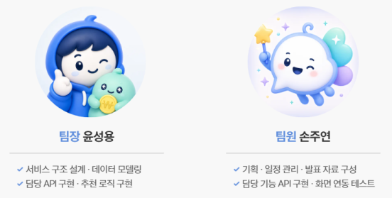
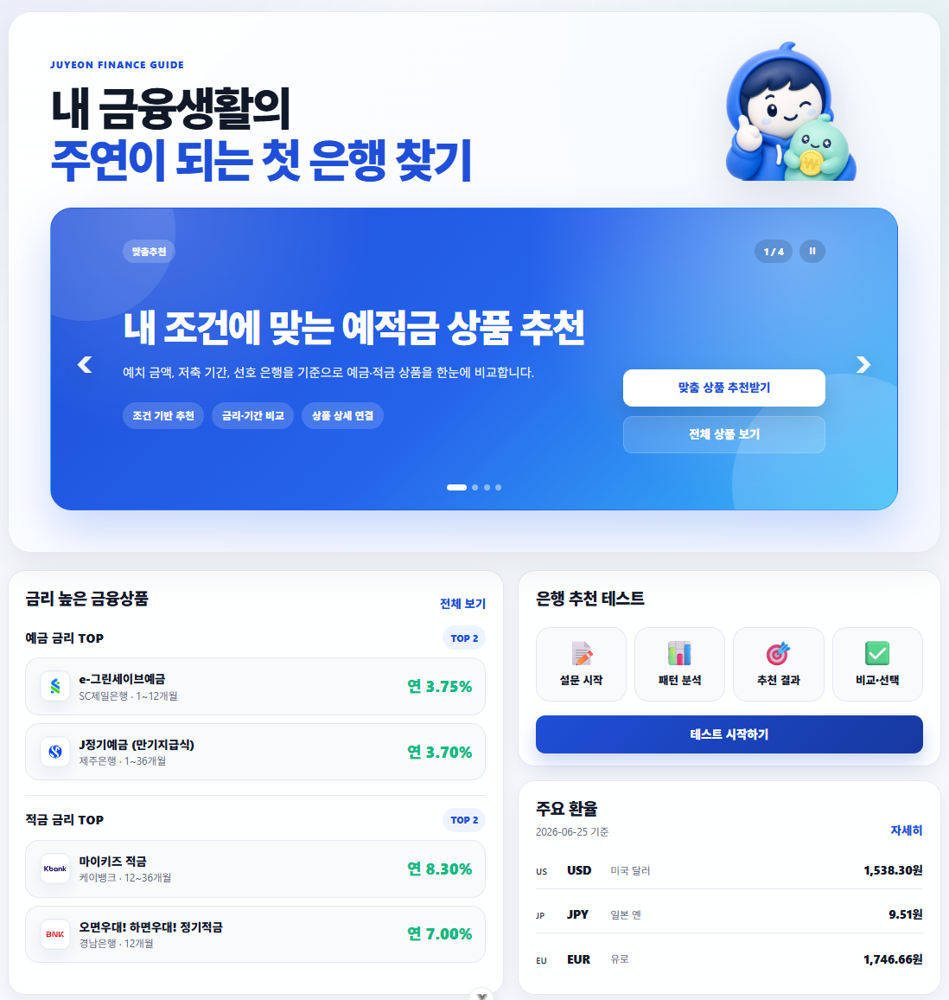
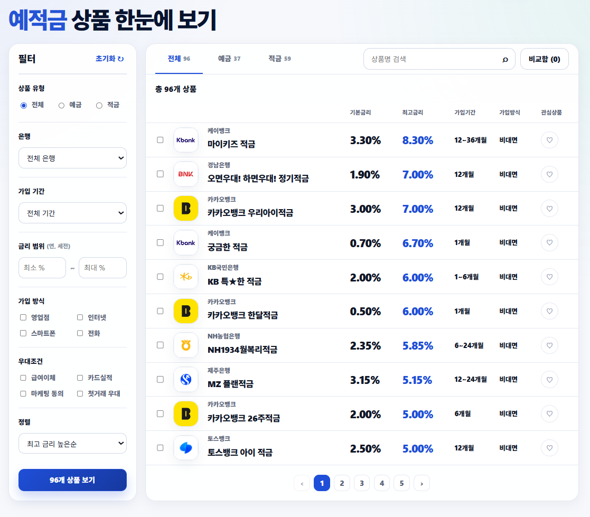
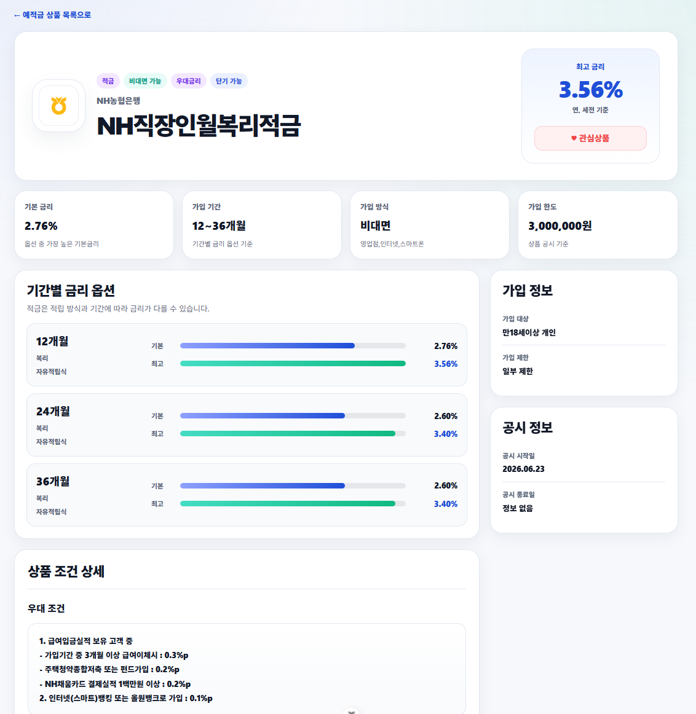
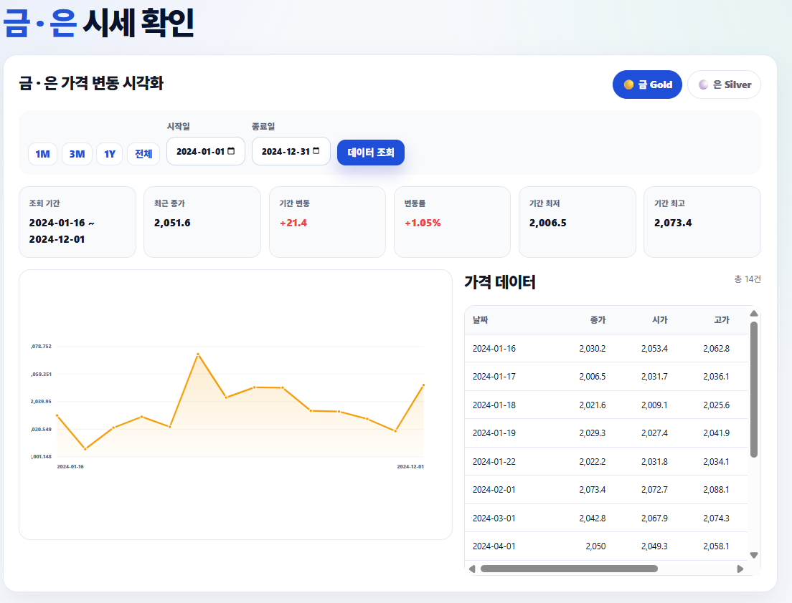
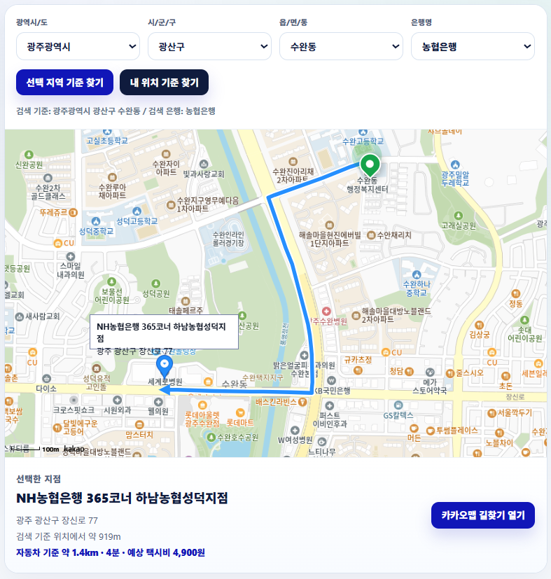
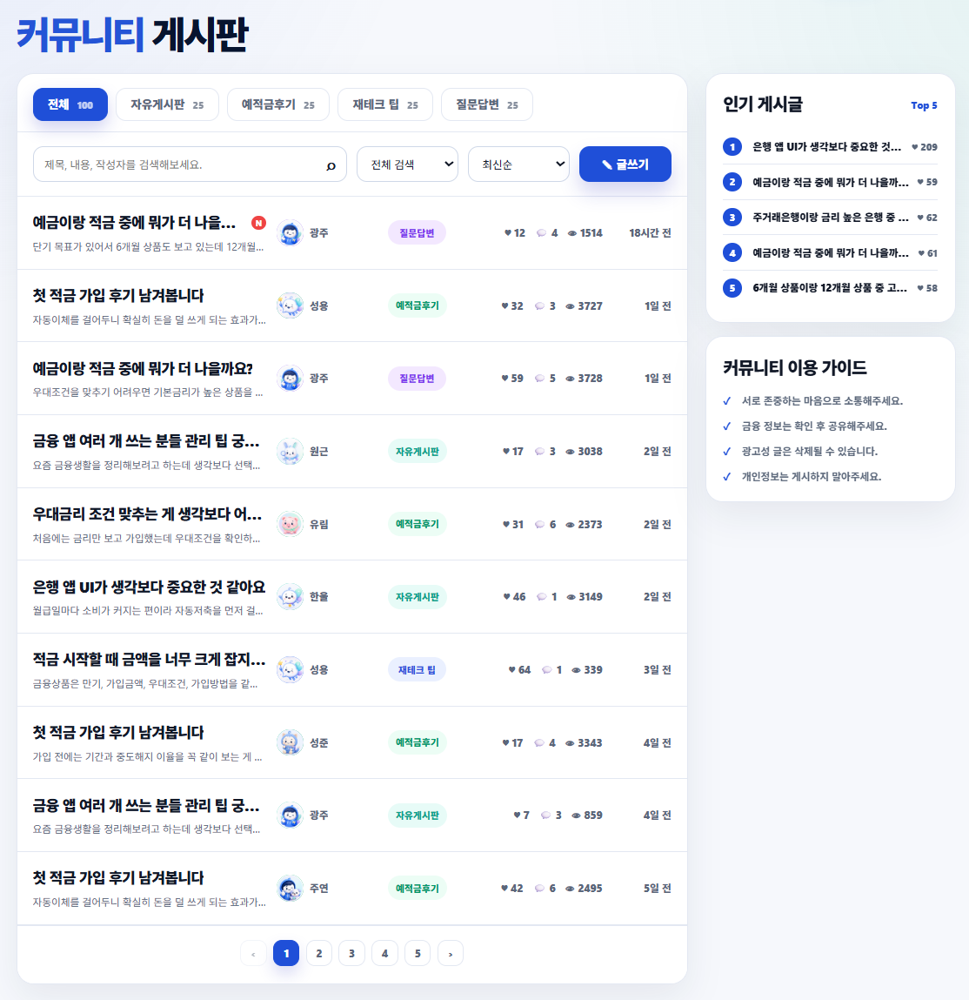
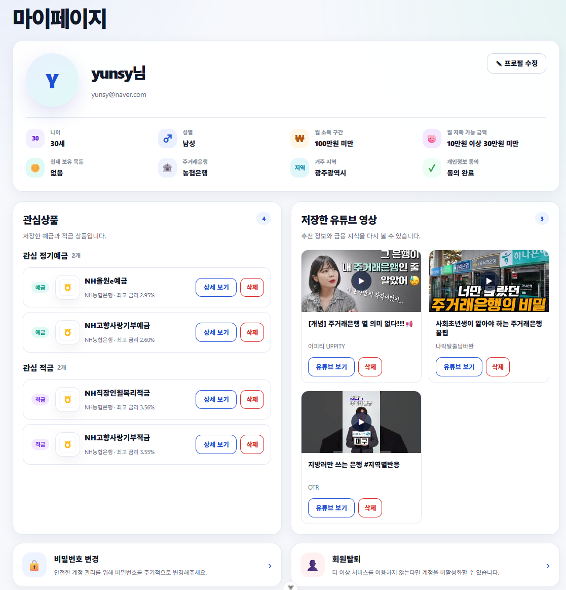
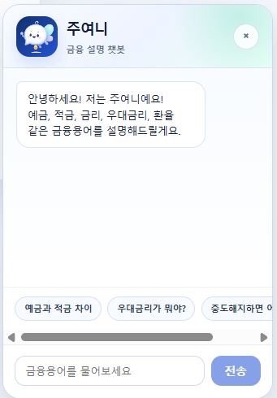
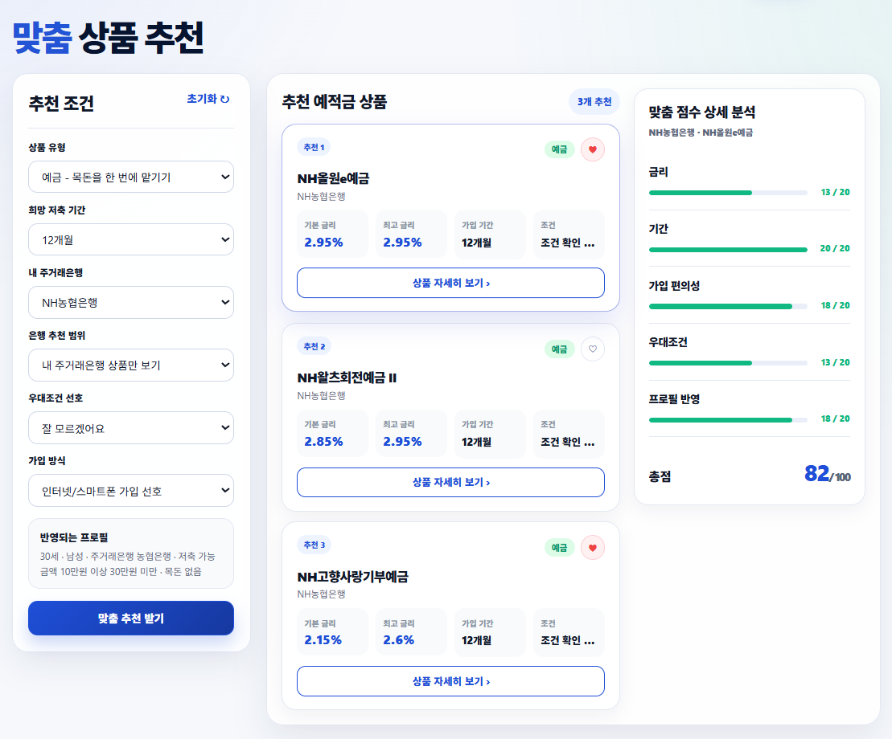

# 주연 - 금융생활 시작 가이드

> 사회초년생과 금융 초보자가 예적금 상품 비교, 맞춤 상품 추천, 주거래은행 탐색, 환율·금은 시세 확인, 커뮤니티, 금융 용어 챗봇을 한 곳에서 사용할 수 있도록 만든 금융생활 시작 가이드 서비스입니다.

## 목차

1. [프로젝트 개요](#1-프로젝트-개요)
2. [기획 배경](#2-기획-배경)
3. [팀원 및 역할 분담](#3-팀원-및-역할-분담)
4. [주요 기능 요약](#4-주요-기능-요약)
5. [요구사항별 구현 결과](#5-요구사항별-구현-결과)
6. [금융 상품 추천 알고리즘](#6-금융-상품-추천-알고리즘)
7. [생성형 AI 활용](#7-생성형-ai-활용)
8. [기술 스택](#8-기술-스택)
9. [프로젝트 구조](#9-프로젝트-구조)
10. [실행 방법](#10-실행-방법)
11. [환경 변수](#11-환경-변수)
12. [데이터 및 외부 API](#12-데이터-및-외부-api)
13. [인증 및 권한 정책](#13-인증-및-권한-정책)
14. [트러블슈팅](#14-트러블슈팅)
15. [시연 안정화 처리](#15-시연-안정화-처리)
16. [프로젝트 후기](#16-프로젝트-후기)

<br>

## 1. 프로젝트 개요

**주연(Juyeon Finance Guide)** 은 금융을 어렵게 느끼는 사용자가 자신의 조건에 맞는 금융 상품과 은행을 쉽게 탐색할 수 있도록 돕는 웹 서비스입니다.

사용자는 예금·적금 상품을 한눈에 비교하고, 자신의 목적과 조건에 맞는 상품을 추천받을 수 있습니다. 또한 주거래은행 테스트, 주변 은행 지도 탐색, 주요 환율 확인, 금·은 시세 시각화, 금융 커뮤니티, 금융 용어 챗봇을 함께 제공하여 금융생활을 시작하는 데 필요한 기능을 하나의 흐름으로 사용할 수 있도록 구성했습니다.

### 서비스 핵심 문장

> 내 금융생활의 주연이 되는 첫 은행 찾기

### 주요 대상 사용자

- 예금과 적금의 차이부터 어렵게 느끼는 금융 초보자
- 첫 월급 이후 저축 상품을 알아보는 사회초년생
- 주거래은행을 정하지 못한 사용자
- 여러 은행의 예적금 상품을 한 번에 비교하고 싶은 사용자
- 금융 정보를 커뮤니티와 챗봇을 통해 쉽게 이해하고 싶은 사용자

<br>

## 2. 기획 배경

기존의 금융 상품 비교 서비스는 상품 정보 자체는 많지만, 금융 초보자 입장에서는 어떤 상품이 본인에게 적합한지 판단하기 어렵습니다. 특히 사회초년생은 예치 금액, 저축 기간, 주거래은행, 우대조건, 가입 방식 등을 종합적으로 고려해야 하지만 이 조건들을 직접 비교하기가 쉽지 않습니다.

이 프로젝트는 단순한 상품 목록 제공을 넘어서 다음 흐름을 목표로 했습니다.

```text
금융 정보 탐색
→ 예적금 상품 비교
→ 사용자 조건 기반 추천
→ 주거래은행 탐색
→ 금융 용어 학습
→ 커뮤니티를 통한 경험 공유
```

<br>

## 3. 팀원 및 역할 분담

<p align="center">
  
</p>

| 이름 | 역할 | 담당 내용 |
| --- | --- | --- |
| 윤성용 | 팀장 | 서비스 구조 설계, 데이터 모델링, 담당 API 구현, 추천 로직 구현 |
| 손주연 | 팀원 | 기획, 일정 관리, 발표 자료 구성, 담당 기능 API 구현, 화면 연동 테스트 |

<br>

## 4. 주요 기능 요약

| 구분 | 기능 | 설명 |
| --- | --- | --- |
| 메인 페이지 | 서비스 진입 화면 | 핵심 기능을 배너와 카드 UI로 제공 |
| 회원 기능 | 회원가입, 로그인, 로그아웃, 프로필 | 사용자 정보 기반 맞춤 기능 제공 |
| 예적금 상품 | 상품 목록, 검색, 필터, 정렬, 상세 | 금융감독원 API 기반 예금·적금 상품 비교 |
| 관심상품 | 관심 예금·적금 저장 | 마이페이지에서 저장 상품 확인 및 삭제 |
| 상품 비교 | 복수 상품 비교 | 사용자가 선택한 상품을 비교 대상으로 관리 |
| 맞춤 추천 | 조건 기반 상품 추천 | 기간, 은행, 가입 방식, 우대조건, 사용자 프로필 기반 추천 |
| 주거래은행 | 은행 추천 테스트 | 사용자의 성향과 선호에 맞는 주거래은행 탐색 |
| 지도 | 근처 은행 검색 및 경로 확인 | Kakao Maps 기반 은행 지점 표시 및 길찾기 연결 |
| 환율 | 주요 환율 조회 | 기준일 기반 주요 통화 환율 제공 |
| 금·은 시세 | 현물 자산 시각화 | 날짜 범위별 금·은 가격 변동 그래프 제공 |
| 유튜브 | 주거래은행 가이드 영상 | YouTube API 기반 영상 검색 및 iframe 재생 |
| 커뮤니티 | 게시글, 댓글, 좋아요 | 금융 고민, 상품 후기, 재테크 팁 공유 |
| 챗봇 | 금융 용어 설명 | 금융 용어를 쉬운 문장으로 설명 |

<br>

## 5. 요구사항별 구현 결과

프로젝트 요구명세서의 필수 기능과 심화 기능을 기준으로 구현 결과를 정리했습니다.

### F1301. 메인 페이지 구성

메인 페이지는 서비스의 핵심 기능을 한 화면에서 파악할 수 있도록 구성했습니다. 상단에는 서비스 소개 배너와 Carousel 영역을 배치했고, 하단에는 금리 높은 금융상품, 은행 추천 테스트, 주요 환율을 카드 형태로 배치했습니다.

**구현 내용**

- 서비스 소개 배너 구성
- 예적금 추천 Carousel 구성
- 금리 TOP 상품 미리보기
- 은행 추천 테스트 진입 버튼
- 주요 환율 요약 정보 표시
- 각 기능 페이지로 이동 가능한 CTA 버튼 제공

<p align="center">
  
</p>

<br>

### F1302. 회원 커스터마이징

사용자별 맞춤 추천과 관심상품 저장을 위해 회원 인증 기능과 사용자 프로필 정보를 구성했습니다. 로그인 사용자는 마이페이지에서 기본 정보, 현재 주거래은행, 월 소득 구간, 월 저축 가능 금액, 개인정보 동의 여부 등을 확인할 수 있습니다.

**구현 내용**

- 회원가입, 로그인, 로그아웃 구현
- Custom User 기반 사용자 정보 관리
- 사용자 프로필 조회 및 수정
- 로그인 여부에 따른 보호 페이지 접근 제어
- 사용자 정보 기반 추천 조건 반영

<br>

### F1303-1. 예적금 데이터 저장

금융감독원 금융상품통합비교공시 API를 통해 정기예금과 적금 상품 데이터를 가져오고, 금융회사, 상품, 금리 옵션 정보를 분리해 DB에 저장했습니다. 상품 고유값을 기준으로 중복 저장을 방지하고, API 장애 상황에서도 시연이 가능하도록 fixture 데이터를 함께 구성했습니다.

**구현 내용**

- 금융감독원 API 호출
- 예금·적금 상품 데이터 파싱
- 금융회사, 상품, 옵션 데이터 분리 저장
- 상품 고유값 기준 중복 저장 방지
- fixture 기반 예비 데이터 제공

```text
금융감독원 API 호출
→ 금융회사 / 상품 / 금리 옵션 파싱
→ DB 중복 여부 확인
→ 신규 데이터 저장
→ 프론트엔드에서 DB 데이터 조회
```

<br>

### F1303-2. 예적금 목록 조회

전체 예금·적금 상품을 한눈에 조회할 수 있는 목록 페이지를 구현했습니다. 상품 유형, 은행, 가입 기간, 금리 범위, 가입 방식, 우대조건 등을 기준으로 필터링할 수 있고, 최고금리 또는 기본금리 기준으로 정렬할 수 있습니다.

**구현 내용**

- 전체 / 예금 / 적금 탭 분리
- 상품명 검색
- 은행별 필터
- 가입 기간 필터
- 금리 범위 필터
- 가입 방식 필터
- 우대조건 필터
- 최고금리 높은순 정렬
- 관심상품 등록
- 비교함 선택

<p align="center">
  
</p>

<br>

### F1303-3. 예적금 상세 조회

선택한 금융상품의 상세 정보를 확인할 수 있는 페이지를 구현했습니다. 기본금리, 최고금리, 가입 기간, 가입 방식, 가입 한도, 가입 대상, 공시 정보, 우대 조건을 구분해 표시했습니다. 기간별 금리 옵션은 막대 그래프로 시각화하여 옵션 간 차이를 쉽게 비교할 수 있도록 했습니다.

**구현 내용**

- 상품 기본 정보 표시
- 기본금리 / 최고금리 표시
- 가입 기간별 금리 옵션 표시
- 가입 방식, 가입 한도, 가입 대상 표시
- 우대 조건 상세 표시
- 관심상품 등록
- 목록 페이지 복귀 링크 제공

<p align="center">
  
</p>

<br>

### F1304. 현물 상품 시각화

금과 은 가격 데이터를 기반으로 날짜 범위별 가격 변동을 시각화했습니다. 사용자는 금 또는 은을 선택하고, 시작일과 종료일을 지정해 해당 기간의 시세 흐름을 확인할 수 있습니다.

**구현 내용**

- 금 / 은 자산 선택 탭
- 시작일, 종료일 필터
- 1개월, 3개월, 1년, 전체 기간 빠른 선택
- 기간별 가격 변동 그래프
- 최근 종가, 기간 변동, 변동률, 기간 최저·최고 정보 제공
- 가격 데이터 테이블 제공

<p align="center">
  
</p>

<br>

### F1305-1. 관심 종목 검색

YouTube Data API를 활용하여 주거래은행, 은행 선택 기준, 금융생활 관련 영상을 검색하고 카드 형태로 출력했습니다. 영상 썸네일, 제목, 채널명을 표시하고, 저장 기능을 통해 마이페이지에서 다시 볼 수 있도록 구성했습니다.

**구현 내용**

- 검색창과 검색 버튼 구성
- YouTube Data API 검색 요청
- 썸네일, 제목, 채널명 파싱
- 영상 카드 렌더링
- 영상 저장 기능
- 저장된 영상 상태 표시


### F1305-2. 관심 종목 상세 보기

선택한 영상의 videoId를 기반으로 iframe 재생 영역을 구성했습니다. 사용자는 검색 결과에서 영상을 선택한 뒤 페이지 내에서 바로 재생할 수 있습니다.

**구현 내용**

- 선택 영상 정보 표시
- YouTube iframe 재생
- 영상 제목 및 채널명 표시
- 영상 저장 상태 유지

<p align="center">
  
</p>

<br>

### F1306-1. 근처 은행 검색

Kakao Maps API를 활용하여 사용자가 선택한 지역과 은행명을 기준으로 주변 은행 지점을 지도에 표시했습니다. 선택한 지점의 이름, 주소, 기준 위치와의 거리 정보를 함께 제공합니다.

**구현 내용**

- 광역시/도, 시/군/구, 읍/면/동 선택
- 은행명 선택
- 선택 지역 기준 은행 검색
- 내 위치 기준 은행 검색
- Kakao Map 지도 출력
- 은행 지점 마커 표시
- 선택 지점 정보 표시

### F1306-2. 경로 안내 기능

선택한 은행 지점까지의 이동 정보를 제공하기 위해 Kakao 지도와 길찾기 연결 기능을 구성했습니다. 지도에서 지점을 선택하면 기준 위치에서 선택 지점까지의 경로와 요약 이동 정보를 확인할 수 있습니다.

**구현 내용**

- 선택 은행 지점 마커 표시
- 기준 위치와 은행 지점 간 경로 표시
- 자동차 기준 거리 및 예상 시간 표시
- 예상 택시비 표시
- Kakao Map 길찾기 페이지 연결

<p align="center">
  
</p>

<br>

### F1307. 커뮤니티 기능

사용자가 금융 상품 후기, 예적금 고민, 재테크 팁, 자유게시글을 작성하고 공유할 수 있는 커뮤니티 게시판을 구현했습니다. 게시글과 댓글은 작성자 권한에 따라 수정·삭제 가능하도록 처리했습니다.

**구현 내용**

- 전체 / 자유게시판 / 예적금후기 / 재테크 팁 / 질문답변 카테고리
- 게시글 목록 조회
- 게시글 작성, 수정, 삭제
- 댓글 작성, 수정, 삭제
- 좋아요 기능
- 인기 게시글 표시
- 작성자, 제목, 요약, 작성일, 조회수, 댓글수 표시
- 본인 게시글과 댓글만 수정·삭제 가능

<p align="center">
  
</p>

<br>

### F1308. 프로필 페이지

마이페이지에서 회원 기본 정보, 관심상품, 저장한 유튜브 영상, 비밀번호 변경, 회원탈퇴 기능을 확인할 수 있도록 구성했습니다. 관심 예금과 관심 적금을 구분해 표시하고, 저장한 영상은 카드 형태로 다시 볼 수 있게 했습니다.

**구현 내용**

- 회원 기본 정보 조회
- 프로필 수정 진입
- 나이, 성별, 월 소득 구간, 월 저축 가능 금액 표시
- 현재 보유 목돈, 주거래은행, 거주 지역, 개인정보 동의 여부 표시
- 관심 예금 / 관심 적금 구분 표시
- 저장한 유튜브 영상 표시
- 관심상품 삭제
- 저장 영상 삭제
- 비밀번호 변경 및 회원탈퇴 진입

<p align="center">
  
</p>

<br>


### F1311. 생성형 AI 활용 및 금융 용어 챗봇

금융 초보자가 어려운 금융 용어를 쉽게 이해할 수 있도록 금융 설명 챗봇을 구현했습니다. 사용자는 예금, 적금, 금리, 우대금리, 중도해지 등 기본 금융 용어를 질문할 수 있고, 챗봇은 쉬운 문장으로 개념을 설명합니다.

**구현 내용**

- 금융 용어 설명 챗봇 UI
- 추천 질문 버튼 제공
- 사용자 질문 입력 및 응답 출력
- 예금, 적금, 금리, 우대금리, 환율 등 기초 용어 설명
- 로그인 사용자 대상 기능 제한
- 프로젝트 개발 과정에서 데이터 생성, 추천 로직 정리, 코드 개선 방향 검토에 생성형 AI 활용

<p align="center">
  
</p>

<br>

## 6. 금융 상품 추천 알고리즘

추천 기능은 단순히 금리가 높은 상품을 보여주는 방식이 아니라, 사용자가 입력한 조건과 회원 프로필을 함께 반영해 점수를 계산하는 방식으로 구현했습니다.

### 추천 입력값

| 입력 항목 | 설명 |
| --- | --- |
| 상품 유형 | 예금 또는 적금 선택 |
| 희망 저축 기간 | 6개월, 12개월, 24개월, 36개월 등 |
| 내 주거래은행 | 사용자의 현재 또는 선호 은행 |
| 은행 추천 범위 | 주거래은행 상품만 볼지, 전체 은행 상품을 볼지 선택 |
| 우대조건 선호 | 급여이체, 카드실적, 마케팅 동의, 첫거래 우대 등 |
| 가입 방식 | 인터넷/스마트폰, 영업점 등 가입 편의성 반영 |
| 사용자 프로필 | 나이, 성별, 월 소득 구간, 저축 가능 금액, 현재 보유 목돈 등 |

### 점수 산정 구조

| 평가 항목 | 반영 내용 | 배점 |
| --- | --- | --- |
| 금리 | 최고금리와 기본금리 수준 | 20점 |
| 기간 | 사용자가 선택한 희망 기간과 상품 옵션의 일치도 | 20점 |
| 가입 편의성 | 인터넷, 스마트폰 등 비대면 가입 가능 여부 | 20점 |
| 우대조건 | 사용자가 선호한 우대조건과 상품 조건의 일치도 | 20점 |
| 프로필 반영 | 사용자 소득, 저축 가능 금액, 주거래은행 등과의 적합도 | 20점 |
| 총점 | 위 항목 합산 | 100점 |

### 추천 처리 흐름

```text
사용자 추천 조건 입력
→ 상품 유형 필터링
→ 희망 기간과 상품 옵션 비교
→ 금리 점수 계산
→ 가입 방식 점수 계산
→ 우대조건 일치도 계산
→ 사용자 프로필 적합도 계산
→ 총점 산출
→ 점수 높은 순으로 추천 상품 정렬
→ 상위 상품 3개 출력
```

### 추천 결과 예시

추천 결과 화면에서는 추천 상품 3개와 함께 각 상품의 기본금리, 최고금리, 가입 기간, 조건 요약을 표시합니다. 오른쪽 상세 분석 패널에서는 금리, 기간, 가입 편의성, 우대조건, 프로필 반영 점수를 보여주어 추천 결과의 근거를 확인할 수 있도록 했습니다.

<p align="center">
  
</p>

<br>

## 7. 생성형 AI 활용

프로젝트에서는 생성형 AI를 단순 부가 기능이 아니라 금융 초보자의 이해를 돕는 보조 도구로 활용했습니다.

| 활용 영역 | 활용 내용 |
| --- | --- |
| 금융 용어 설명 | 사용자가 입력한 금융 용어를 쉬운 문장으로 설명 |
| 추천 질문 구성 | 예금과 적금 차이, 우대금리, 중도해지 등 자주 묻는 질문 버튼 제공 |
| 데이터 생성 보조 | 커뮤니티 시연용 더미데이터와 사용자 시나리오 구성 보조 |
| 추천 로직 개선 | 추천 점수 항목과 사용자 조건 반영 방식 정리 |
| 코드 개선 | API 오류 처리, 컴포넌트 분리, 화면 연동 방식 검토 |

<br>

## 8. 기술 스택

### Backend

| 구분 | 기술 |
| --- | --- |
| Language | Python |
| Framework | Django, Django REST Framework |
| Database | SQLite |
| Auth | Token 기반 인증 |
| Data | Django Fixture, 외부 API 응답 데이터 |

### Frontend

| 구분 | 기술 |
| --- | --- |
| Language | JavaScript |
| Framework | Vue 3 |
| Build Tool | Vite |
| Routing | Vue Router |
| HTTP Client | Axios |
| Chart | Chart.js |
| Map | Kakao Maps API |

### External API

| API | 사용 목적 |
| --- | --- |
| 금융감독원 금융상품통합비교공시 API | 예금·적금 상품 데이터 수집 |
| 한국수출입은행 환율 API | 기준일 기반 주요 환율 조회 |
| Kakao Maps API | 지도 출력, 은행 지점 검색 |
| Kakao Mobility API | 선택 지점 경로 안내 |
| YouTube Data API | 금융·주거래은행 관련 영상 검색 |
| GMS API | 금융 용어 챗봇 |

<br>

## 9. 프로젝트 구조

```text
13-pjt/
├── backend/
│   ├── accounts/
│   ├── products/
│   ├── exchanges/
│   ├── community/
│   ├── maps/
│   ├── videos/
│   ├── chatbot/
│   ├── config/
│   ├── manage.py
│   └── requirements.txt
│
├── frontend/
│   ├── src/
│   │   ├── api/
│   │   ├── assets/
│   │   ├── components/
│   │   ├── router/
│   │   ├── stores/
│   │   ├── views/
│   │   └── App.vue
│   ├── package.json
│   └── vite.config.js
│
├── docs/
│   ├── api/
│   │   └── api_spec.md
│   ├── architecture/
│   │   ├── architecture.md
│   │   └── architecture.png
│   ├── erd/
│   │   ├── erd_description.md
│   │   ├── erd_finance_detail.png
│   │   ├── erd_overview.png
│   │   └── erd_service_detail.png
│   ├── images/
│   │   ├── 00_team_roles.png
│   │   ├── 01_main.png
│   │   ├── 02_mypage.png
│   │   ├── 03_products_list.png
│   │   ├── 04_product_detail.png
│   │   ├── 05_gold_silver.png
│   │   ├── 06_youtube.png
│   │   ├── 07_bank_map.png
│   │   ├── 08_community.png
│   │   ├── 09_recommend.png
│   │   └── 10_chatbot.png
│   ├── requirements/
│   │   └── requirements.xlsx
│   ├── wireframe/
│   │   ├── Bankmap.png
│   │   ├── chatbot_1.png
│   │   ├── chatbot_2.png
│   │   ├── Community_and_Comments.png
│   │   ├── Exchange_Calculator.png
│   │   ├── log_in_and_out.png
│   │   ├── MainBankTest_and_Result.png
│   │   ├── mainpage.png
│   │   ├── mypage.png
│   │   └── Products_Recommendation.png
│   └── PROJECT_ERD_ARCHITECTURE_SUMMARY.md
│
├── presentation/
│   └── SSAFY 1학기 관통 프로젝트 - 금융 (1).pdf
│
└── README.md
```

> ERD와 아키텍처 문서는 별도 README 또는 설계 문서에서 관리합니다. 메인 README에는 서비스 설명, 실행 방법, 요구사항별 구현 결과, 추천 알고리즘, AI 활용 내용을 중심으로 정리했습니다.

<br>

## 10. 실행 방법

### 10-1. Backend 실행

```bash
cd backend

python -m venv venv
source venv/Scripts/activate
pip install -r requirements.txt
```

Windows PowerShell을 사용하는 경우:

```bash
.\venv\Scripts\activate
```

DB 마이그레이션:

```bash
python manage.py makemigrations
python manage.py migrate
```

fixture 데이터 로드:

```bash
python manage.py loaddata products/fixtures/products.json
python manage.py loaddata exchanges/fixtures/exchange_rates.json
```

커뮤니티 시연 데이터 생성:

```bash
python manage.py seed_community --reset
```

서버 실행:

```bash
python manage.py runserver
```

기본 백엔드 주소:

```text
http://127.0.0.1:8000/
```

<br>

### 10-2. Frontend 실행

```bash
cd frontend

npm install
npm run dev
```

기본 프론트엔드 주소:

```text
http://localhost:5173/
```

<br>

### 10-3. 발표 전 권장 실행 순서

```bash
# backend
cd backend
python manage.py migrate
python manage.py loaddata products/fixtures/products.json
python manage.py loaddata exchanges/fixtures/exchange_rates.json
python manage.py seed_community --reset
python manage.py runserver
```

```bash
# frontend
cd frontend
npm install
npm run dev
```

<br>

## 11. 환경 변수

외부 API Key와 Django Secret Key는 `.env` 파일로 분리하여 관리합니다. 실제 키 값은 Git에 커밋하지 않습니다.

### Backend `.env` 예시

```env
SECRET_KEY=your_django_secret_key
DEBUG=True

FINLIFE_API_KEY=금융감독원_API_KEY
EXCHANGE_API_KEY=한국수출입은행_환율_API_KEY
KAKAO_REST_API_KEY=카카오_REST_API_KEY
YOUTUBE_API_KEY=유튜브_DATA_API_KEY
GMS_API_KEY=AI_API_KEY
```

### Frontend `.env` 예시

```env
VITE_API_BASE_URL=http://127.0.0.1:8000
VITE_KAKAO_MAP_API_KEY=카카오_JAVASCRIPT_KEY
```

### Git 관리 기준

```text
.env
venv/
node_modules/
db.sqlite3
__pycache__/
.DS_Store
```

위 항목은 `.gitignore`에 포함하여 GitLab 제출 시 제외합니다.

<br>

## 12. 데이터 및 외부 API

### 예적금 상품 데이터

예금·적금 상품 데이터는 금융감독원 금융상품통합비교공시 API를 통해 가져옵니다.

```text
금융감독원 API
→ 정기예금 / 적금 응답 수신
→ 금융회사, 상품, 옵션 데이터 파싱
→ DB 저장
→ 프론트엔드 상품 목록과 상세 페이지에서 조회
```

API 장애나 네트워크 문제에 대비하여 fixture 데이터를 제공합니다.

```bash
python manage.py loaddata products/fixtures/products.json
```

<br>

### 환율 데이터

환율 데이터는 한국수출입은행 환율 API를 기반으로 조회합니다. 환율은 실시간 틱 데이터가 아니라 기준일 기반 데이터이므로 화면과 README에서는 **주요 환율** 또는 **기준일 기준 주요 환율**로 표현했습니다.

```text
DB에 기준일 환율 데이터 있음
→ DB 데이터 반환

DB에 기준일 환율 데이터 없음
→ 한국수출입은행 API 호출
→ DB 저장
→ DB 데이터 반환

API 오류 발생
→ fixture 데이터 사용
```

fixture 로드:

```bash
python manage.py loaddata exchanges/fixtures/exchange_rates.json
```

<br>

### 금·은 가격 데이터

제공된 금·은 가격 데이터셋을 활용하여 날짜별 가격 흐름을 시각화했습니다.

```text
Gold_prices.xlsx / Silver_prices.xlsx
→ 날짜별 가격 데이터 파싱
→ 선택 기간 필터링
→ Chart.js 그래프 출력
→ 가격 데이터 테이블 출력
```

<br>

### 지도 데이터

Kakao Maps API를 활용하여 선택 지역 주변의 은행 지점을 검색하고 지도 위에 마커를 표시했습니다. 선택 지점에 대해서는 Kakao 길찾기 연결과 거리, 예상 시간, 예상 택시비 정보를 제공합니다.

<br>

### YouTube 데이터

YouTube Data API를 활용하여 주거래은행 선택, 금융생활, 은행별 특징과 관련된 영상을 검색하고, 선택 영상은 iframe으로 재생할 수 있도록 구성했습니다.

<br>

## 13. 인증 및 권한 정책

### 비회원 접근 가능

- 메인 페이지 조회
- 예적금 상품 목록 조회
- 예적금 상품 상세 조회
- 주요 환율 조회
- 금·은 시세 조회
- 커뮤니티 게시글 조회
- 주변 은행 지도 조회

### 로그인 필요

- 맞춤 상품 추천
- 주거래은행 추천 테스트
- 마이페이지 조회
- 프로필 수정
- 관심상품 등록 및 삭제
- 상품 비교함 사용
- 커뮤니티 글쓰기
- 댓글 작성
- 좋아요
- 유튜브 영상 저장
- 금융 용어 챗봇 사용

### 권한 처리

- 본인이 작성한 게시글만 수정·삭제할 수 있습니다.
- 본인이 작성한 댓글만 수정·삭제할 수 있습니다.
- 관심상품과 저장 영상은 로그인한 사용자 본인의 데이터만 조회합니다.
- 인증이 필요한 API 요청에는 Token을 포함합니다.

<br>

## 14. 트러블슈팅

프로젝트 진행 중 대표적으로 발생한 문제와 원인, 해결 방안을 정리했습니다.

| 문제 | 원인 | 해결 |
| --- | --- | --- |
| 로그인 후 인증이 필요한 API 요청에서 401 Unauthorized 오류 발생 | 프론트 토큰 저장 방식과 백엔드 응답 구조 불일치 | 응답 구조를 통일하고 Axios interceptor로 Authorization 헤더 자동 적용 |
| 환율 데이터 조회 API가 정상 응답하지 않음 | 외부 환율 API의 요청 URL 형식 변경 | 공식 문서 기준으로 요청 URL과 파라미터 수정 |
| 금융상품 데이터 저장 과정에서 IntegrityError 발생 | 외부 API 응답에 Null 값이 포함됨 | 모델 필드와 저장 로직에서 Null 값 예외 처리 추가 |

<br>

## 15. 시연 안정화 처리

외부 API를 사용하는 프로젝트 특성상 네트워크 상태나 API 응답 제한에 따라 시연 중 오류가 발생할 수 있습니다. 이를 줄이기 위해 다음과 같이 처리했습니다.

| 상황 | 처리 방식 |
| --- | --- |
| 금융감독원 API 응답 실패 | 상품 fixture 데이터 로드 후 DB 기반 조회 |
| 한국수출입은행 환율 API 응답 실패 | 환율 fixture 데이터 fallback |
| 인증이 필요한 요청에서 Token 없음 | 로그인 안내 및 접근 제한 |
| 커뮤니티 데이터 부족 | `seed_community --reset` 명령어로 시연 데이터 생성 |
| 지도 검색 결과 없음 | 선택 지역과 은행명 기준 안내 문구 출력 |
| 추천 결과 없음 | 조건 완화 안내 및 대체 문구 출력 |

<br>

## 16. 프로젝트 후기

이번 프로젝트는 단순히 금융 상품을 조회하고 보여주는 서비스를 만드는 것을 넘어, 사용자가 실제로 금융생활을 시작할 때 필요한 기능들을 하나의 흐름으로 연결하는 데 중점을 두었습니다. 예적금 상품 비교, 맞춤 상품 추천, 주거래은행 탐색, 지도 기반 은행 검색, 커뮤니티, 챗봇 기능을 함께 구현하면서 사용자 중심의 금융 서비스 구조를 고민할 수 있었습니다.

### 팀장 윤성용

서비스의 전체 구조 설계와 데이터 모델링, 주요 API 구현, 추천 로직 구현을 담당했습니다. 프로젝트를 진행하면서 기능을 개별적으로 구현하는 것보다, 각 기능이 하나의 서비스 흐름 안에서 자연스럽게 연결되도록 설계하는 것이 중요하다는 점을 체감했습니다.

특히 외부 API를 연동하는 과정에서 인증 오류, API 응답 지연, 데이터 중복 저장, 예외 처리 등 실제 서비스에서 고려해야 할 문제들을 경험했습니다. 이를 해결하기 위해 fixture 데이터를 활용한 fallback 처리와 DB 저장 구조를 고민하면서 서비스 안정성의 중요성을 배울 수 있었습니다.

또한 추천 기능을 구현하면서 단순히 최고금리 상품을 보여주는 방식만으로는 사용자에게 충분한 맞춤형 경험을 제공하기 어렵다고 판단했습니다. 그래서 가입 기간, 가입 방식, 우대조건, 사용자 프로필 등을 함께 반영하는 추천 로직으로 개선하며 사용자 조건 기반 추천 서비스의 방향성을 잡을 수 있었습니다.

### 팀원 손주연

기획, 일정 관리, 발표 자료 구성, 담당 기능 API 구현과 화면 연동 테스트를 담당했습니다. 프로젝트 초반에는 금융 서비스를 어떻게 사용자 친화적으로 풀어낼지 고민이 많았지만, 기능을 하나씩 구체화하면서 사용자의 입장에서 필요한 흐름을 설계하는 경험을 할 수 있었습니다.

프론트엔드와 백엔드를 연결하는 과정에서는 API 응답 형식과 필드명이 일관되지 않으면 화면 구현과 테스트 과정에서 문제가 생긴다는 점을 체감했습니다. 이를 통해 데이터 구조를 명확히 정리하고, 백엔드와 프론트엔드 간의 약속을 맞추는 과정이 중요하다는 것을 배웠습니다.

또한 기획부터 구현, 테스트, 발표 자료 정리까지 프로젝트 전 과정을 함께 경험하면서 단순히 기능을 만드는 것뿐만 아니라 서비스의 목적과 사용자 경험을 계속 점검하는 것이 중요하다는 점을 느꼈습니다. 이후에는 추천 로직의 정확도와 사용자 편의성을 더 개선해보고 싶습니다.

### 종합 소감

이번 프로젝트를 통해 금융 상품 추천 서비스는 단순한 데이터 조회 서비스가 아니라, 사용자 정보와 금융 데이터를 연결해 실질적인 선택을 도와주는 서비스가 되어야 한다는 점을 배웠습니다. 구현 과정에서 API 연동, 데이터 모델링, 인증 처리, 예외 처리, 화면 연동, 추천 알고리즘까지 다양한 요소를 경험할 수 있었고, 이를 통해 하나의 웹 서비스를 완성해가는 전체 흐름을 이해할 수 있었습니다.
