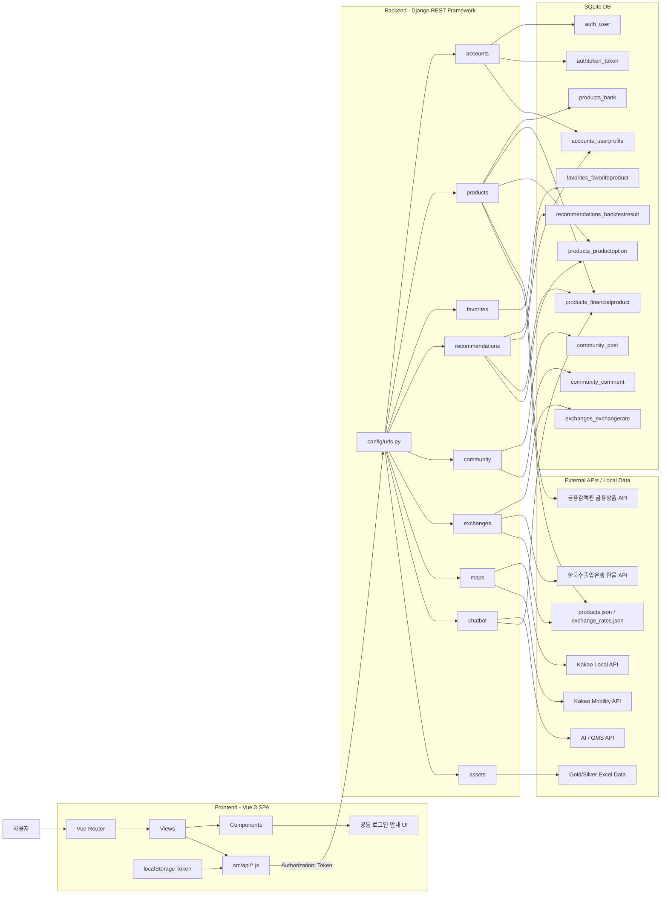
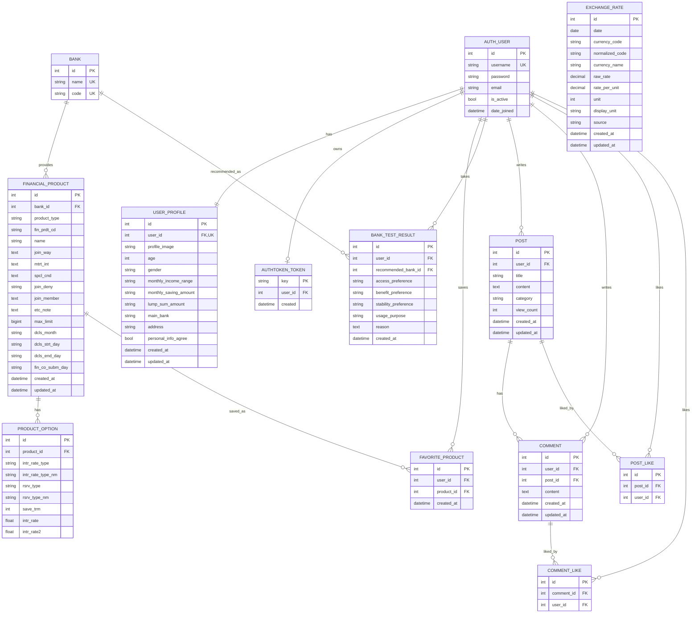
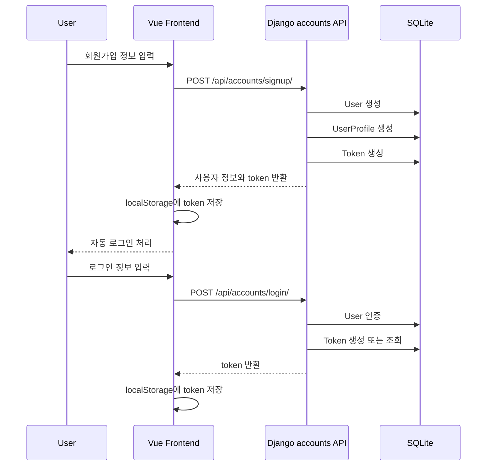
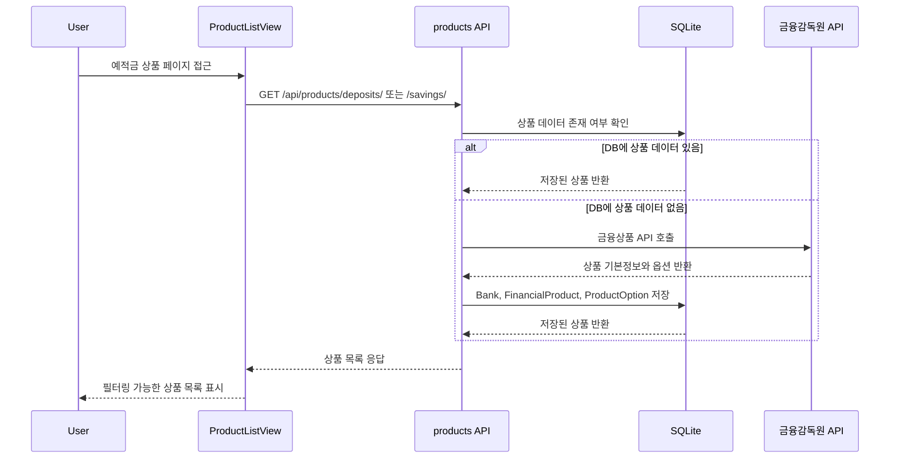
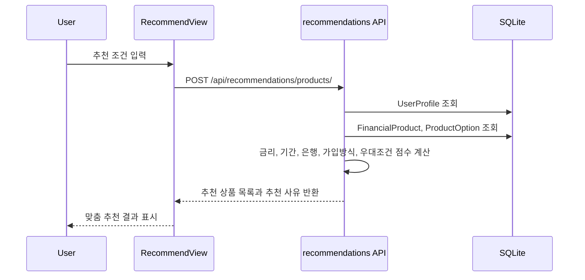
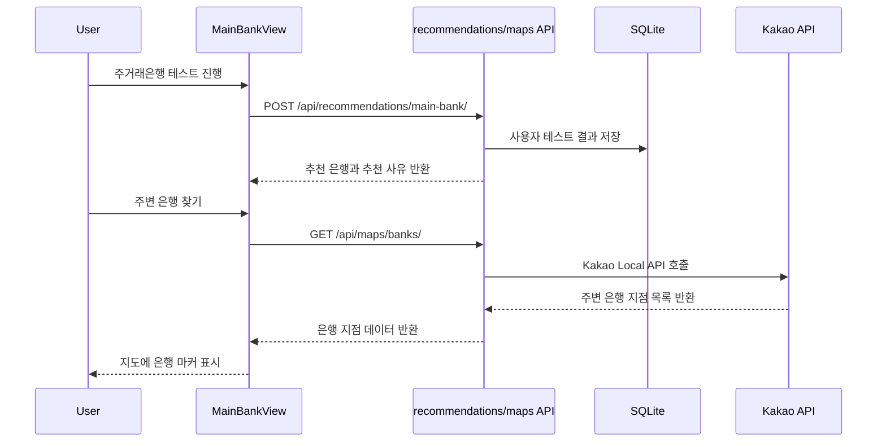
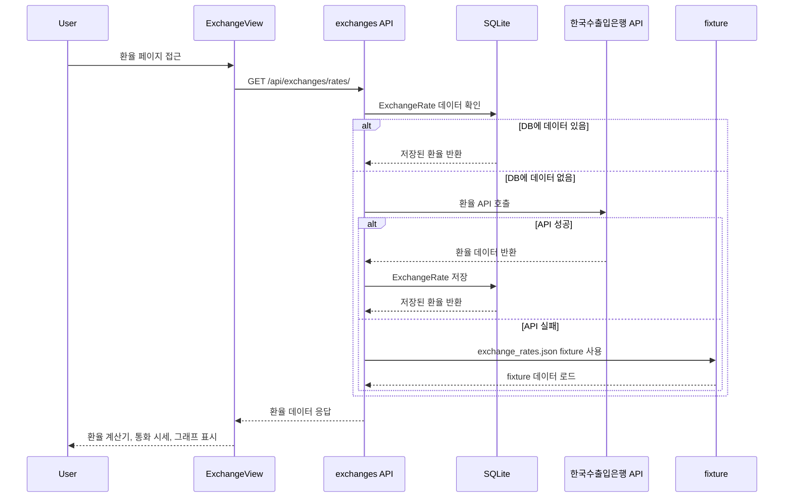
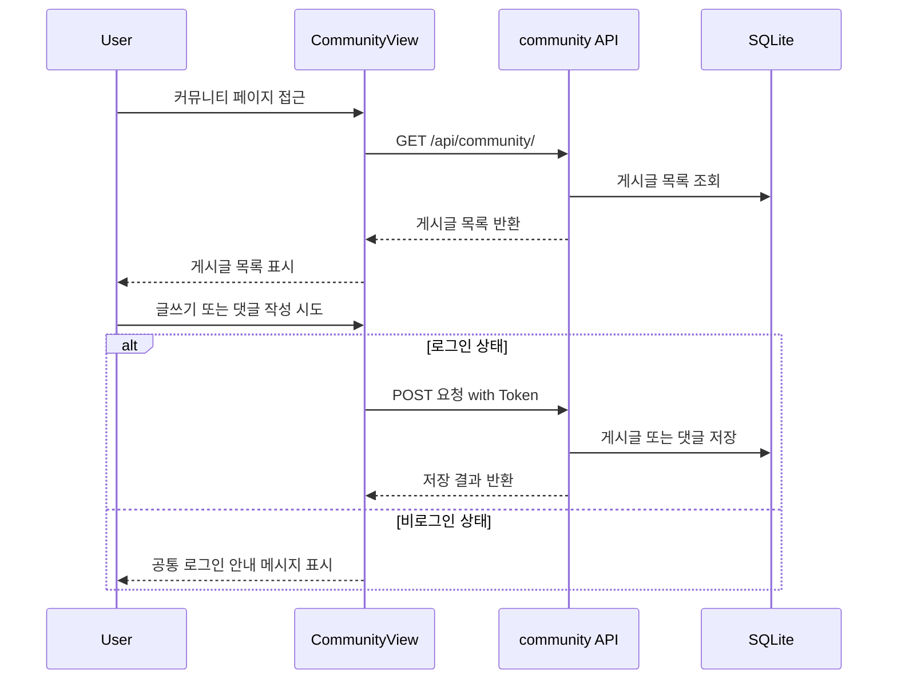

# 주연 금융생활 가이드 ERD · 아키텍처 · 구현 정리

> 프로젝트명: 주연
> 주제: 사회초년생을 위한 예적금 추천 및 금융생활 시작 가이드 서비스
> 기술 범위: Django REST Framework 백엔드, Vue 3 프론트엔드, DB 모델, 외부 API 연동, fixture 기반 데이터 안정화

---

## 1. 프로젝트 한 줄 정의

**주연**은 사용자의 금융 프로필과 선호 조건을 기반으로 예금·적금 상품을 조회·비교·추천하고, 주거래은행 찾기, 환율 계산, 금·은 시세, 금융 챗봇, 커뮤니티 기능을 제공하는 금융생활 시작 가이드 서비스이다.

---

## 2. 프로젝트 기획 의도

금융을 처음 접하는 사회초년생은 예금, 적금, 금리, 환율, 주거래은행 같은 개념을 어렵게 느끼는 경우가 많다.
본 프로젝트는 사용자가 금융상품을 단순히 검색하는 것에서 끝나지 않고, 자신의 조건에 맞는 상품과 은행을 추천받고, 환율과 금·은 시세를 함께 확인하며, 커뮤니티와 챗봇을 통해 금융 정보를 쉽게 이해할 수 있도록 설계했다.

서비스의 핵심 목표는 다음과 같다.

```text
1. 예금·적금 상품을 한눈에 비교할 수 있게 한다.
2. 사용자 조건에 맞는 금융상품을 추천한다.
3. 사회초년생에게 적합한 주거래은행 선택을 돕는다.
4. 환율과 금·은 시세를 함께 제공해 금융 정보 접근성을 높인다.
5. 커뮤니티와 챗봇을 통해 금융 정보를 쉽게 공유하고 이해하도록 한다.
6. 외부 API 장애 상황에서도 fixture 데이터를 통해 안정적으로 시연할 수 있게 한다.
```

---

## 3. 전체 기술 스택

| 구분           | 사용 기술                         | 역할                   |
| ------------ | ----------------------------- | -------------------- |
| Frontend     | Vue 3, Vite                   | SPA 화면 구성            |
| Routing      | Vue Router                    | 페이지 라우팅 및 로그인 가드     |
| API 통신       | Axios                         | Django REST API 호출   |
| Chart        | Chart.js                      | 환율, 금·은 시세 그래프 표시    |
| Backend      | Django                        | 서버 애플리케이션            |
| API          | Django REST Framework         | REST API 제공          |
| Auth         | DRF TokenAuthentication       | 로그인 토큰 발급 및 인증       |
| DB           | SQLite                        | 개발 및 시연용 데이터베이스      |
| Fixture      | Django fixture                | 외부 API 장애 대비용 데이터 로드 |
| External API | 금융감독원, 한국수출입은행, Kakao, AI API | 상품, 환율, 지도, 챗봇 기능    |
| Local Data   | Excel                         | 금·은 가격 데이터 로딩        |

---

## 4. 전체 폴더 구조

### Backend

```text
backend/
├── config/
│   ├── settings.py
│   └── urls.py
│
├── accounts/
│   ├── models.py
│   ├── serializers.py
│   ├── views.py
│   └── urls.py
│
├── products/
│   ├── models.py
│   ├── serializers.py
│   ├── views.py
│   ├── urls.py
│   └── fixtures/
│       └── products.json
│
├── favorites/
│   ├── models.py
│   ├── serializers.py
│   ├── views.py
│   └── urls.py
│
├── recommendations/
│   ├── models.py
│   ├── serializers.py
│   ├── views.py
│   └── urls.py
│
├── community/
│   ├── models.py
│   ├── serializers.py
│   ├── views.py
│   └── urls.py
│
├── exchanges/
│   ├── models.py
│   ├── views.py
│   ├── urls.py
│   └── fixtures/
│       └── exchange_rates.json
│
├── maps/
│   ├── views.py
│   └── urls.py
│
├── chatbot/
│   ├── views.py
│   └── urls.py
│
├── assets/
│   ├── data/
│   │   ├── Gold_prices.xlsx
│   │   └── Silver_prices.xlsx
│   ├── views.py
│   └── urls.py
│
└── manage.py
```

### Frontend

```text
frontend/
├── src/
│   ├── api/
│   │   ├── api.js
│   │   ├── accounts.js
│   │   ├── products.js
│   │   ├── favorites.js
│   │   ├── recommendations.js
│   │   ├── community.js
│   │   └── exchanges.js
│   │
│   ├── assets/
│   │   ├── logo.png
│   │   └── juyeon-character.png
│   │
│   ├── components/
│   │   ├── NavBar.vue
│   │   ├── AuthNotice.vue
│   │   ├── ChatbotFloatingButton.vue
│   │   ├── ChatbotWindow.vue
│   │   └── ProductCard.vue
│   │
│   ├── router/
│   │   └── index.js
│   │
│   ├── utils/
│   │   └── authNotice.js
│   │
│   ├── views/
│   │   ├── HomeView.vue
│   │   ├── LoginView.vue
│   │   ├── SignupView.vue
│   │   ├── FindUsernameView.vue
│   │   ├── ResetPasswordView.vue
│   │   ├── MyPageView.vue
│   │   ├── ProductListView.vue
│   │   ├── ProductDetailView.vue
│   │   ├── RecommendView.vue
│   │   ├── MainBankView.vue
│   │   ├── ExchangeView.vue
│   │   ├── SpotAssetView.vue
│   │   └── CommunityView.vue
│   │
│   ├── App.vue
│   └── main.js
│
├── package.json
└── vite.config.js
```

---

## 5. 시스템 아키텍처



---

## 6. Django App별 책임

| App               | DB 모델 보유 | 주요 책임                                                   |
| ----------------- | -------: | ------------------------------------------------------- |
| `accounts`        |        O | 회원가입, 로그인, 로그아웃, 프로필, 아이디 찾기, 비밀번호 재설정, 마이페이지           |
| `products`        |        O | 금융감독원 API 기반 예금·적금 상품 저장, 상품 목록/상세 조회                   |
| `favorites`       |        O | 로그인 사용자의 관심상품 추가, 삭제, 조회                                |
| `recommendations` |        O | 주거래은행 테스트 결과 저장, 예적금 상품 추천 점수 계산                        |
| `community`       |        O | 게시글, 댓글, 좋아요, 조회수                                       |
| `exchanges`       |        O | 한국수출입은행 환율 API 데이터 저장, 환율 계산, 기간별 그래프, fixture fallback |
| `maps`            |        X | Kakao API 기반 은행 지점 검색, 지도/경로 조회                         |
| `chatbot`         |        X | 금융 용어 설명 챗봇, 상품 DB context 활용                           |
| `assets`          |        X | 금·은 Excel 데이터 기반 시세 조회                                  |

---

## 7. ERD



---

## 8. 테이블 설계 설명

### 8-1. 사용자 / 프로필

| 테이블                    | 설명                                   |
| ---------------------- | ------------------------------------ |
| `auth_user`            | Django 기본 사용자 테이블                    |
| `authtoken_token`      | DRF TokenAuthentication에서 사용하는 인증 토큰 |
| `accounts_userprofile` | 사용자 금융 프로필 확장 테이블                    |

`UserProfile`은 사용자와 1:1 관계를 가진다.
나이, 성별, 월 소득 구간, 월 저축 가능 금액, 현재 보유 목돈, 주거래은행, 거주 지역, 개인정보 동의 여부 등을 저장한다.
이 정보는 마이페이지 표시와 맞춤 예적금 추천의 보조 조건으로 활용된다.

### 8-2. 금융상품

| 테이블                         | 설명                             |
| --------------------------- | ------------------------------ |
| `products_bank`             | 은행명과 금융회사 코드 저장                |
| `products_financialproduct` | 예금·적금 상품의 기본 정보 저장             |
| `products_productoption`    | 상품별 기간, 금리 유형, 기본금리, 최고우대금리 저장 |

금융감독원 API의 상품 기본 정보는 `FinancialProduct`에 저장하고, 기간별 금리 옵션은 `ProductOption`에 저장한다.
하나의 은행은 여러 금융상품을 가질 수 있고, 하나의 금융상품은 가입 기간과 금리 조건에 따라 여러 옵션을 가질 수 있다.

### 8-3. 관심상품

| 테이블                         | 설명               |
| --------------------------- | ---------------- |
| `favorites_favoriteproduct` | 사용자가 저장한 관심 금융상품 |

사용자는 마음에 드는 예금·적금 상품을 관심상품으로 저장할 수 있다.
관심상품은 마이페이지에서 확인할 수 있으며, 같은 사용자가 같은 상품을 중복 저장하지 않도록 관리한다.

### 8-4. 추천 결과

| 테이블                              | 설명                        |
| -------------------------------- | ------------------------- |
| `recommendations_banktestresult` | 주거래은행 성향 테스트 결과와 추천 은행 저장 |

주거래은행 추천 결과는 사용자, 추천 은행, 테스트 응답, 추천 사유를 저장한다.
예적금 상품 추천은 별도 결과 테이블을 만들지 않고, 요청 시점에 DB에 저장된 상품 옵션을 점수화하여 응답한다.

### 8-5. 환율

| 테이블                      | 설명               |
| ------------------------ | ---------------- |
| `exchanges_exchangerate` | 날짜별 통화 환율 데이터 저장 |

환율 데이터는 한국수출입은행 API에서 가져온 뒤 `ExchangeRate` 모델에 저장한다.
DB에 데이터가 있으면 외부 API를 다시 호출하지 않고 DB 데이터를 사용한다.
또한 `exchange_rates.json` fixture를 제공하여 API 장애 상황에서도 환율 계산과 그래프를 안정적으로 시연할 수 있다.

### 8-6. 커뮤니티

| 테이블                       | 설명         |
| ------------------------- | ---------- |
| `community_post`          | 커뮤니티 게시글   |
| `community_comment`       | 게시글 댓글     |
| `community_post_likes`    | 게시글 좋아요 관계 |
| `community_comment_likes` | 댓글 좋아요 관계  |

게시글과 댓글은 작성자와 연결된다.
비회원은 게시글 조회가 가능하지만, 게시글 작성, 댓글 작성, 좋아요는 로그인 사용자만 가능하다.

---

## 9. 주요 기능 구현 정리

### 9-1. 인증 / 회원 관리

| 기능       | Frontend                | Backend API                           | 처리 방식                                 |
| -------- | ----------------------- | ------------------------------------- | ------------------------------------- |
| 회원가입     | `SignupView.vue`        | `POST /api/accounts/signup/`          | User 생성 후 UserProfile 생성, 성공 시 자동 로그인 |
| 로그인      | `LoginView.vue`         | `POST /api/accounts/login/`           | 사용자 인증 후 Token 반환                     |
| 로그아웃     | `NavBar.vue`            | `POST /api/accounts/logout/`          | 서버 토큰 삭제 및 프론트 localStorage 정리        |
| 아이디 찾기   | `FindUsernameView.vue`  | `POST /api/accounts/find-username/`   | 이메일 기준 username 조회                    |
| 비밀번호 재설정 | `ResetPasswordView.vue` | `POST /api/accounts/reset-password/`  | username, email 확인 후 새 비밀번호 저장        |
| 프로필 조회   | `MyPageView.vue`        | `GET /api/accounts/profile/`          | 로그인 사용자 프로필 반환                        |
| 프로필 수정   | `MyPageView.vue`        | `PATCH /api/accounts/profile/update/` | 금융 프로필 및 이미지 수정                       |

인증 방식은 DRF TokenAuthentication을 사용한다.
로그인 성공 시 발급된 토큰은 프론트의 `localStorage`에 저장되고, 인증이 필요한 요청에는 `Authorization: Token {token}` 형식으로 전달된다.

---

### 9-2. 예금 / 적금 상품

| 기능       | API                                        | 처리 방식                   |
| -------- | ------------------------------------------ | ----------------------- |
| 예금 상품 저장 | `GET /api/products/deposits/save/`         | 금융감독원 예금 API 호출 후 DB 저장 |
| 예금 상품 목록 | `GET /api/products/deposits/`              | DB 상품 목록 반환             |
| 예금 상품 상세 | `GET /api/products/deposits/<product_id>/` | 상품 기본정보와 금리 옵션 반환       |
| 적금 상품 저장 | `GET /api/products/savings/save/`          | 금융감독원 적금 API 호출 후 DB 저장 |
| 적금 상품 목록 | `GET /api/products/savings/`               | DB 상품 목록 반환             |
| 적금 상품 상세 | `GET /api/products/savings/<product_id>/`  | 상품 기본정보와 금리 옵션 반환       |

예적금 상품은 외부 API에서 조회한 데이터를 바로 화면에 출력하지 않고, DB에 저장한 뒤 프론트에 반환한다.
이를 통해 필터링, 정렬, 상세 조회, 추천 점수 계산을 안정적으로 처리할 수 있다.

API 장애에 대비해 `products/fixtures/products.json` fixture를 제공한다.

---

### 9-3. 맞춤 예적금 추천

| 기능        | API                                    | 처리 방식                     |
| --------- | -------------------------------------- | ------------------------- |
| 예적금 상품 추천 | `POST /api/recommendations/products/`  | 사용자 조건과 상품 옵션을 기반으로 점수 계산 |
| 주거래은행 추천  | `POST /api/recommendations/main-bank/` | 성향 테스트 응답 기반 은행 추천        |
| 추천 이력 조회  | `GET /api/recommendations/history/`    | 로그인 사용자 추천 결과 조회          |

예적금 상품 추천은 다음 요소를 반영한다.

```text
1. 기본금리
2. 최고우대금리
3. 희망 가입 기간
4. 예치 방식: 목돈 예치 / 매달 저축
5. 상품 유형: 예금 / 적금
6. 주거래은행 여부
7. 가입 방식: 비대면 / 영업점 / 스마트폰 등
8. 우대조건 단순성
9. 마이페이지 금융 프로필
```

추천 결과는 단순히 상품만 보여주는 것이 아니라, 사용자가 선택한 조건과 상품이 맞는 이유를 함께 제공한다.

---

### 9-4. 주거래은행 찾기

| 기능        | API                                    | 처리 방식                          |
| --------- | -------------------------------------- | ------------------------------ |
| 주거래은행 테스트 | `POST /api/recommendations/main-bank/` | 사용자 성향 기반 추천 은행 계산             |
| 주변 은행 검색  | `GET /api/maps/banks/`                 | Kakao Local API 기반 은행 지점 검색    |
| 경로 조회     | `GET /api/maps/routes/`                | Kakao Mobility API 기반 경로 정보 조회 |

주거래은행 찾기는 사용자의 금융 성향과 은행 접근성을 함께 고려한다.
사용자는 테스트를 통해 자신에게 맞는 은행을 확인하고, 지도에서 주변 지점을 탐색할 수 있다.

---

### 9-5. 환율 계산 및 주요 통화 시세

| 기능         | API                                      | 처리 방식                         |
| ---------- | ---------------------------------------- | ----------------------------- |
| 환율 목록      | `GET /api/exchanges/rates/`              | DB 환율 데이터 반환, 없으면 API 호출 후 저장 |
| 기간별 환율     | `GET /api/exchanges/history/`            | 날짜 범위에 맞는 DB 환율 데이터 반환        |
| 환율 계산      | `POST /api/exchanges/calculate/`         | KRW 기준 환율 계산                  |
| 환율 fixture | `exchanges/fixtures/exchange_rates.json` | API 장애 대비용 데이터                |

환율 데이터 흐름은 다음과 같다.

```text
DB에 환율 데이터 있음
→ DB 데이터 반환

DB에 환율 데이터 없음
→ 한국수출입은행 API 호출
→ ExchangeRate 모델에 저장
→ DB 데이터 반환

API 장애 또는 시연 환경 문제 발생
→ exchange_rates.json fixture 로드
→ DB 데이터 기반 화면 표시
```

이 구조를 통해 외부 API가 불안정한 상황에서도 환율 계산기, 주요 통화 시세, 기간별 환율 그래프를 안정적으로 시연할 수 있다.

---

### 9-6. 금·은 시세

| 기능      | API                                    | 처리 방식                 |
| ------- | -------------------------------------- | --------------------- |
| 금 시세 조회 | `GET /api/assets/prices/?asset=gold`   | Excel 데이터 로딩 후 기간 필터링 |
| 은 시세 조회 | `GET /api/assets/prices/?asset=silver` | Excel 데이터 로딩 후 기간 필터링 |

금·은 시세는 별도의 `SpotAssetView.vue` 페이지로 분리했다.
사용자는 금과 은 가격 흐름을 날짜별로 확인하고, 환율 페이지와 구분된 시세 정보를 볼 수 있다.

---

### 9-7. 커뮤니티

| 기능       | API                                                | 처리 방식            |
| -------- | -------------------------------------------------- | ---------------- |
| 게시글 목록   | `GET /api/community/`                              | 전체 게시글 목록 반환     |
| 게시글 작성   | `POST /api/community/`                             | 로그인 사용자만 작성      |
| 게시글 상세   | `GET /api/community/<post_id>/`                    | 게시글 상세 정보와 댓글 반환 |
| 게시글 수정   | `PUT /api/community/<post_id>/`                    | 작성자만 가능          |
| 게시글 삭제   | `DELETE /api/community/<post_id>/`                 | 작성자만 가능          |
| 게시글 좋아요  | `POST /api/community/<post_id>/like/`              | 로그인 사용자 좋아요 토글   |
| 댓글 작성    | `POST /api/community/<post_id>/comments/`          | 로그인 사용자만 작성      |
| 댓글 수정/삭제 | `PUT/DELETE /api/community/comments/<comment_id>/` | 작성자만 가능          |

커뮤니티는 비회원도 게시글을 조회할 수 있도록 했다.
다만 글쓰기, 댓글 작성, 좋아요 같은 참여 기능은 로그인 사용자만 가능하다.
비회원이 참여 기능을 시도하면 브라우저 기본 alert 대신 공통 안내 메시지를 보여준다.

---

### 9-8. 금융 용어 챗봇

| 기능       | API                          | 처리 방식                    |
| -------- | ---------------------------- | ------------------------ |
| 금융 용어 설명 | `POST /api/chatbot/explain/` | AI API 호출                |
| 상품 설명 보조 | `POST /api/chatbot/explain/` | 상품 DB context를 활용한 답변 생성 |

챗봇은 예금, 적금, 금리, 환율 같은 금융 용어를 쉽게 설명한다.
사용자의 질문에 DB에 저장된 상품명이 포함되어 있으면 해당 상품 정보를 context로 활용해 답변한다.
챗봇은 로그인 사용자만 이용할 수 있으며, 비회원이 클릭하면 챗봇 아이콘 위에 안내 문구를 표시한다.

---

## 10. 프론트엔드 화면 - 기능 매핑

| Route             | View                    | 주요 기능                   | 로그인 필요 |
| ----------------- | ----------------------- | ----------------------- | ------ |
| `/`               | `HomeView.vue`          | 메인 화면, 기능 카드 슬라이더       | X      |
| `/products`       | `ProductListView.vue`   | 예적금 상품 목록, 필터, 검색, 비교   | X      |
| `/products/:id`   | `ProductDetailView.vue` | 상품 상세 정보, 금리 옵션, 관심상품   | 일부     |
| `/recommend`      | `RecommendView.vue`     | 맞춤 예적금 추천               | O      |
| `/exchange`       | `ExchangeView.vue`      | 환율 계산, 주요 통화 시세, 환율 그래프 | X      |
| `/spot-assets`    | `SpotAssetView.vue`     | 금·은 시세 조회               | X      |
| `/main-bank`      | `MainBankView.vue`      | 주거래은행 찾기, 은행 지도         | O      |
| `/map`            | `MainBankView.vue`      | 주변 은행 지도                | O      |
| `/community`      | `CommunityView.vue`     | 커뮤니티 게시글 목록, 상세, 작성, 댓글 | 일부     |
| `/mypage`         | `MyPageView.vue`        | 내 정보, 금융 프로필, 관심상품      | O      |
| `/login`          | `LoginView.vue`         | 로그인                     | X      |
| `/signup`         | `SignupView.vue`        | 회원가입                    | X      |
| `/find-username`  | `FindUsernameView.vue`  | 아이디 찾기                  | X      |
| `/reset-password` | `ResetPasswordView.vue` | 비밀번호 재설정                | X      |

---

## 11. API 라우팅 구조

```text
/api/accounts/
  signup/
  login/
  logout/
  find-username/
  reset-password/
  password/change/
  withdraw/
  profile/
  profile/update/
  profile/options/

/api/products/
  deposits/save/
  deposits/
  deposits/<product_id>/
  savings/save/
  savings/
  savings/<product_id>/

/api/favorites/
  <empty>
  <product_id>/

/api/recommendations/
  main-bank/
  history/
  products/

/api/community/
  <empty>
  <post_id>/
  <post_id>/like/
  <post_id>/comments/
  comments/<comment_id>/
  comments/<comment_id>/like/

/api/exchanges/
  rates/
  history/
  calculate/

/api/maps/
  banks/
  routes/

/api/chatbot/
  explain/

/api/assets/
  prices/
```

---

## 12. 주요 사용자 흐름

### 12-1. 회원가입 및 로그인 흐름



---

### 12-2. 예적금 상품 조회 흐름



---

### 12-3. 맞춤 예적금 추천 흐름



---

### 12-4. 주거래은행 및 지도 흐름



---

### 12-5. 환율 조회 흐름



---

### 12-6. 커뮤니티 흐름



---

## 13. 추천 알고리즘 정리

### 13-1. 주거래은행 추천

입력값:

```text
access_preference       모바일 / 영업점 / 상관없음
benefit_preference      높은 금리 / 간단한 조건 / 안정성
stability_preference    시중은행 / 인터넷은행 / 상관없음
usage_purpose           목돈 보관 / 이자 수익 / 단기 운용
```

판단 로직:

```text
1. 모바일 편의성 또는 인터넷은행 선호 → 인터넷은행 계열 가점
2. 높은 금리 또는 이자 수익 선호 → 고금리 상품 보유 은행 가점
3. 안정성 또는 시중은행 선호 → 주요 시중은행 가점
4. 간단한 조건 선호 → 우대조건이 단순한 상품을 가진 은행 가점
5. 사용 목적과 은행 특성을 비교해 최종 추천 은행 선정
```

---

### 13-2. 예적금 상품 추천

입력값:

```text
saving_style            목돈 예치 / 매달 저축
product_type            예금 / 적금 / 자동
preferred_term          희망 가입 기간
main_bank               사용자 주거래은행
bank_filter             전체 / 주거래은행 우선 / 주거래은행만
condition_preference    단순 조건 / 조건 충족 가능
join_preference         비대면 / 영업점 / 상관없음
```

점수 요소:

| 요소     | 반영 방식                     |
| ------ | ------------------------- |
| 기본금리   | 기본금리가 높을수록 가점             |
| 최고우대금리 | 최고우대금리가 높을수록 가점           |
| 희망 기간  | 사용자가 선택한 기간과 일치하면 가점      |
| 저축 방식  | 목돈은 예금, 매월 저축은 적금에 가점     |
| 주거래은행  | 사용자 주거래은행과 상품 은행이 일치하면 가점 |
| 가입 방식  | 사용자의 선호 가입 방식과 일치하면 가점    |
| 우대조건   | 단순 조건 선호 시 복잡한 조건 감점      |
| 금융 프로필 | 월 저축 가능 금액, 보유 목돈 등 보조 반영 |

---

## 14. Fixture 데이터 관리

외부 API는 네트워크 상태, API 서버 상태, 인증키 문제에 따라 실패할 수 있다.
이를 대비하기 위해 본 프로젝트는 예적금 상품과 환율 데이터를 fixture로 관리한다.

### 14-1. 예적금 상품 fixture

파일 위치:

```text
backend/products/fixtures/products.json
```

로드 명령어:

```bash
python manage.py loaddata products/fixtures/products.json
```

### 14-2. 환율 fixture

파일 위치:

```text
backend/exchanges/fixtures/exchange_rates.json
```

로드 명령어:

```bash
python manage.py loaddata exchanges/fixtures/exchange_rates.json
```

환율 fixture는 한국수출입은행 API가 정상 동작할 때 저장한 데이터를 기반으로 구성했다.
따라서 발표 시 API가 불안정하더라도 환율 계산기와 그래프를 안정적으로 보여줄 수 있다.

### 14-3. 발표 전 권장 실행 순서

```bash
cd backend

python manage.py migrate
python manage.py loaddata products/fixtures/products.json
python manage.py loaddata exchanges/fixtures/exchange_rates.json
python manage.py seed_community --reset

python manage.py runserver
```

프론트:

```bash
cd frontend

npm install
npm run dev
```

---

## 15. 인증 및 접근 제어

### 비회원 접근 가능

```text
메인 페이지
예적금 상품 목록
예적금 상품 상세
환율 계산 및 시세
금·은 시세
커뮤니티 게시글 조회
로그인
회원가입
아이디 찾기
비밀번호 재설정
```

### 로그인 필요

```text
맞춤 예적금 추천
주거래은행 찾기
주변 은행 지도
마이페이지
관심상품 등록
상품 비교
커뮤니티 글쓰기
댓글 작성
좋아요
챗봇 사용
```

로그인이 필요한 페이지에 비회원이 접근하면 공통 안내 메시지를 보여주고 로그인 페이지로 이동한다.
단, 커뮤니티의 글쓰기, 댓글, 좋아요는 로그인 페이지로 강제 이동하지 않고 현재 페이지에서 안내 메시지만 표시한다.
챗봇은 로그인하지 않은 사용자가 클릭하면 챗봇 아이콘 위에 별도 안내 문구를 표시한다.

---

## 16. 환경 변수

백엔드 `.env` 예시:

```env
SECRET_KEY=your_django_secret_key
DEBUG=True

FINLIFE_API_KEY=금융감독원_API_KEY
EXCHANGE_API_KEY=한국수출입은행_환율_API_KEY
KAKAO_REST_API_KEY=카카오_REST_API_KEY
OPENAI_API_KEY=AI_API_KEY
GMS_API_KEY=GMS_API_KEY
GMS_BASE_URL=AI_API_BASE_URL
GMS_MODEL=사용_모델명
```

주의사항:

```text
.env 파일은 Git에 커밋하지 않는다.
API 키가 노출된 경우 재발급한다.
.env.example에는 변수명만 작성하고 실제 키 값은 넣지 않는다.
```

---

## 17. 현재 구조의 장점

```text
1. 기능별 Django app 분리가 명확하다.
2. 예금·적금 상품을 외부 API에서 가져온 뒤 DB에 저장해 추천과 필터링에 활용한다.
3. 사용자 금융 프로필을 추천 로직에 반영해 개인화 요소를 제공한다.
4. 환율 데이터도 DB에 저장하고 fixture로 관리해 API 장애에 대비했다.
5. Vue Router의 meta.requiresAuth를 통해 보호 페이지 접근을 제어한다.
6. 브라우저 기본 alert 대신 공통 로그인 안내 UI를 사용해 사용자 경험을 통일했다.
7. 커뮤니티는 비회원 조회와 로그인 사용자 참여 기능을 분리해 접근성을 높였다.
8. 환율과 금·은 시세를 분리해 금융 데이터 화면의 구조를 명확히 했다.
```

---

## 18. 개선 가능 사항

### 18-1. 운영 환경 보안

현재는 개발 및 발표용 설정을 기준으로 한다.
실제 배포 환경에서는 다음 설정을 조정해야 한다.

```text
DEBUG=True → False
CORS_ALLOW_ALL_ORIGINS=True → 허용 도메인 제한
SECRET_KEY 하드코딩 금지
API Key .env 관리
HTTPS 적용
```

### 18-2. 상품 저장 API Method

현재 상품 저장 API는 초기 데이터 적재 편의를 위해 GET 방식으로 사용할 수 있다.
실제 운영 환경에서는 DB를 변경하는 요청이므로 POST 방식 또는 관리용 command, 배치 작업으로 분리하는 것이 더 적절하다.

### 18-3. 환율 데이터 갱신 자동화

현재는 API 호출 또는 fixture 로드를 통해 환율 데이터를 관리한다.
실제 서비스라면 매일 정해진 시간에 환율 API를 호출해 `ExchangeRate`를 갱신하는 batch 작업 또는 scheduler를 추가할 수 있다.

### 18-4. API 레이어 통일

프론트의 API 요청은 `src/api/api.js`의 공통 axios 인스턴스를 기준으로 통일하는 것이 유지보수에 좋다.
모든 요청에서 baseURL, Authorization header, 401 처리 방식이 일관되게 적용되어야 한다.

---

## 19. 발표용 아키텍처 설명 문장

프론트엔드는 Vue 3 기반 SPA로 구성했고, Vue Router를 통해 예적금 상품, 맞춤추천, 주거래은행, 환율, 금·은 시세, 커뮤니티 화면을 전환합니다. 백엔드는 Django REST Framework 기반으로 accounts, products, recommendations, exchanges, community 등 기능별 app을 분리했습니다. 인증은 DRF TokenAuthentication을 사용하며, 로그인 후 발급된 토큰을 localStorage에 저장하고 필요한 요청에 Authorization 헤더로 전달합니다.

예적금 상품은 금융감독원 API에서 가져와 Bank, FinancialProduct, ProductOption 모델에 저장한 뒤 DB 데이터를 기준으로 조회와 추천을 수행합니다. 추천 기능은 상품의 금리 옵션과 사용자의 금융 프로필을 함께 반영해 점수를 계산합니다. 환율은 한국수출입은행 API 데이터를 ExchangeRate 모델에 저장하고, API 장애에 대비해 fixture 데이터를 로드할 수 있도록 구성했습니다. 이를 통해 외부 API가 불안정한 상황에서도 주요 금융 데이터 화면을 안정적으로 시연할 수 있습니다.

---

## 20. 발표용 ERD 설명 문장

ERD의 중심은 Django 기본 User와 확장 프로필인 UserProfile입니다. 사용자는 금융 프로필을 가지고, 이 정보는 맞춤 예적금 추천의 보조 조건으로 사용됩니다. 금융상품은 Bank, FinancialProduct, ProductOption으로 분리했습니다. 하나의 은행은 여러 상품을 가지고, 하나의 상품은 가입 기간이나 금리 유형에 따라 여러 옵션을 가집니다.

사용자는 FavoriteProduct를 통해 관심상품을 저장하고, BankTestResult를 통해 주거래은행 추천 결과를 남깁니다. 환율 데이터는 ExchangeRate 모델에 날짜별, 통화별로 저장되며, 환율 계산과 그래프는 이 데이터를 기준으로 동작합니다. 커뮤니티는 Post와 Comment로 구성되며, 게시글과 댓글에는 각각 좋아요 관계가 연결됩니다.

---

## 21. 최종 기능 명세 요약

| 대분류    | 기능                                         |
| ------ | ------------------------------------------ |
| 회원     | 회원가입, 로그인, 로그아웃, 아이디 찾기, 비밀번호 재설정          |
| 마이페이지  | 금융 프로필 조회/수정, 프로필 이미지, 관심상품 조회             |
| 예적금 상품 | 예금/적금 API 수집, DB 저장, 목록 조회, 상세 조회, 필터링, 비교 |
| 맞춤추천   | 사용자 조건 기반 예적금 상품 추천, 추천 사유 제공              |
| 주거래은행  | 금융 성향 테스트, 추천 은행 제공, 주변 은행 지도              |
| 환율     | 주요 통화 시세, 환율 계산, 기간별 그래프, fixture fallback |
| 금·은 시세 | 금 시세, 은 시세, 날짜별 가격 흐름                      |
| 커뮤니티   | 게시글 CRUD, 댓글 CRUD, 좋아요, 비회원 조회             |
| 챗봇     | 금융 용어 설명, 상품 정보 기반 쉬운 설명                   |
| 공통 UI  | 로그인 안내 토스트, 보호 라우터, 네비바 상태 분기              |
